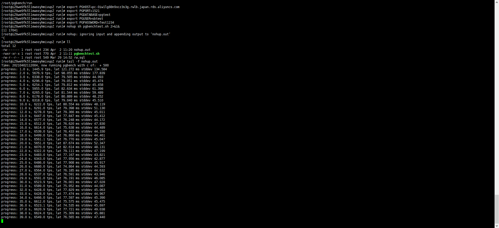

# Pgbench on PolarDB-Oracle（PolarDB-Postgresql）

今回はPgbenchのベンチマークテストをご紹介、テスト対象はPolarDB-Oracleです（PolarDB-Postgresqlも同じテスト方法で実行します）

##　概要
本文章はPgbenchでPolarDB-Oracleをテストする方法をご紹介します。

## 1 Pgbench環境を準備する
## 2 PolarDB-Oracleを性能測定する

## 1 Pgbench環境を準備する

###　Pgbenchとは
Pgbench はPostgreSQLのベンチマークテストに用いられるプログラムです。

###　ECSでPgbench環境を用意する
### 1) ECSインスタンスを作成する
```
ECS：
Specifications:	64 vCPU 512 GiB ecs.r5.16xlarge
OS：CentOS  7.7 64-bit
```


### 2) ECSでPgbench環境をインストールする


①下記コマンドを実行し、ECSでpostgresql-12をインストールする

```
# Install the repository RPM:
sudo yum install -y https://download.postgresql.org/pub/repos/yum/reporpms/EL-7-x86_64/pgdg-redhat-repo-latest.noarch.rpm

# Install PostgreSQL:
sudo yum install -y postgresql12-server

# Optionally initialize the database and enable automatic start:
sudo /usr/pgsql-12/bin/postgresql-12-setup initdb

```


②Postgresql-12を起動する
```
sudo systemctl enable postgresql-12
sudo systemctl start postgresql-12
sudo systemctl status postgresql-12
```


③bash_profileを設定する
```
su - postgres
vi .bash_profile
export PS1="$USER@`/bin/hostname -s`-> "    
export LANG=en_US.utf8    
export PGHOME=/usr/pgsql-12  
export LD_LIBRARY_PATH=$PGHOME/lib:/lib64:/usr/lib64:/usr/local/lib64:/lib:/usr/lib:/usr/local/lib:$LD_LIBRARY_PATH    
export DATE=`date +"%Y%m%d%H%M"`  
export PATH=$PGHOME/bin:$PATH:.    
export MANPATH=$PGHOME/share/man:$MANPATH    
alias rm='rm -i'    
alias ll='ls -lh'    
unalias vi
```


 

④Postgresqlはデフォルトで/usr/pgsql-12/binにインストールされている、Pathを追加する

```
[root@iZ6we9fk5l1ewooyhmivupZ /]# /etc/profile
-bash: /etc/profile: Permission denied
[root@iZ6we9fk5l1ewooyhmivupZ /]# chmod 755 /etc/profile
[root@iZ6we9fk5l1ewooyhmivupZ /]# /etc/profile
[root@iZ6we9fk5l1ewooyhmivupZ /]# export PATH=$PATH:/usr/pgsql-12/bin
[root@iZ6we9fk5l1ewooyhmivupZ /]# pgbench --version
pgbench (PostgreSQL) 12.6

```


ここまでPgbenchがインストール完了しました

下記のサイトをご参照ください
https://help.aliyun.com/document_detail/118338.html
https://www.postgresql.org/download/linux/redhat/

## 2 PolarDB-Oracleを性能測定する
### 1) PolarDB-Oracleインスタンスを作成する
PolarDB-Oracle
Specifications:polar.o.x4.xlarge 8Core32GB
Primary Endpoints:Pgbenchデータ用意するときはこのホストで接続します


Cluster Endpoints:Pgbenchテストするときはこのホストで接続します


ホワイトリスト：

アカウント：

データベース：


### 2) pgbenchテストデータを用意する
①Pathを設定：

```
[root@iZ6we9fk5l1ewooyhmivupZ prepare]# export PGHOST=pc-0iw1lg88n9xcz3s3g.o.polardb.japan.rds.aliyuncs.com
[root@iZ6we9fk5l1ewooyhmivupZ prepare]# export PGPORT=1521
[root@iZ6we9fk5l1ewooyhmivupZ prepare]# export PGDATABASE=pgtest
[root@iZ6we9fk5l1ewooyhmivupZ prepare]# export PGUSER=sbtest
[root@iZ6we9fk5l1ewooyhmivupZ prepare]# export PGPASSWORD=Test1234
[root@iZ6we9fk5l1ewooyhmivupZ prepare]# pgbench --version
pgbench (PostgreSQL) 12.6
```


②pgbenchで２０億のデータをデータベースpgtestに初期化する
```
[root@iZ6we9fk5l1ewooyhmivupZ prepare]# pwd
/root/pgbench/prepare
[root@iZ6we9fk5l1ewooyhmivupZ prepare]# ll
total 0
[root@iZ6we9fk5l1ewooyhmivupZ prepare]# nohup pgbench -i -s 20000 2>&1&
[1] 14688
[root@iZ6we9fk5l1ewooyhmivupZ prepare]# nohup: ignoring input and appending output to ‘nohup.out’
^C
[root@iZ6we9fk5l1ewooyhmivupZ prepare]# ll
total 4
-rw------- 1 root root 295 Apr  1 16:28 nohup.out
[root@iZ6we9fk5l1ewooyhmivupZ prepare]# tail -f nohup.out 
517400000 of 2000000000 tuples (25%) done (elapsed 2837.28 s, remaining 8130.18 s)
517500000 of 2000000000 tuples (25%) done (elapsed 2837.79 s, remaining 8129.51 s)
517600000 of 2000000000 tuples (25%) done (elapsed 2838.28 s, remaining 8128.80 s)
517700000 of 2000000000 tuples (25%) done (elapsed 2838.75 s, remaining 8128.03 s)
517800000 of 2000000000 tuples (25%) done (elapsed 2839.24 s, remaining 8127.31 s)
517900000 of 2000000000 tuples (25%) done (elapsed 2839.71 s, remaining 8126.53 s)


```


③pgbenchデータの初期化を確認する

```
[root@iZ6we9fk5l1ewooyhmivupZ prepare]# pwd
/root/pgbench/prepare
[root@iZ6we9fk5l1ewooyhmivupZ prepare]# ll
total 1628
-rw------- 1 root root 1666543 Apr  1 22:02 nohup.out
[root@iZ6we9fk5l1ewooyhmivupZ prepare]# tail -f nohup.out 
1999400000 of 2000000000 tuples (99%) done (elapsed 11030.34 s, remaining 3.31 s)
1999500000 of 2000000000 tuples (99%) done (elapsed 11030.82 s, remaining 2.76 s)
1999600000 of 2000000000 tuples (99%) done (elapsed 11031.31 s, remaining 2.21 s)
1999700000 of 2000000000 tuples (99%) done (elapsed 11031.80 s, remaining 1.66 s)
1999800000 of 2000000000 tuples (99%) done (elapsed 11032.27 s, remaining 1.10 s)
1999900000 of 2000000000 tuples (99%) done (elapsed 11032.80 s, remaining 0.55 s)
2000000000 of 2000000000 tuples (100%) done (elapsed 11033.28 s, remaining 0.00 s)
vacuuming...
creating primary keys...
done.
```


④データを確認する


### 4) pgbenchで性能測定する
①PolarDB-Oracleインスタンスを接続する。
②pgbench性能測定
```
[root@iZ6we9fk5l1ewooyhmivupZ run]# export PGHOST=pc-0iw1lg88n9xcz3s3g.rdlb.japan.rds.aliyuncs.com
[root@iZ6we9fk5l1ewooyhmivupZ run]# export PGPORT=1521
[root@iZ6we9fk5l1ewooyhmivupZ run]# export PGDATABASE=pgtest
[root@iZ6we9fk5l1ewooyhmivupZ run]# export PGUSER=sbtest
[root@iZ6we9fk5l1ewooyhmivupZ run]# export PGPASSWORD=Test1234
```
```
[root@iZ6we9fk5l1ewooyhmivupZ run]# nohup sh pgbenchtest.sh 2>&1&
```


③pgbenchtest.sh
```
#!/bin/sh
#DATE=`date '+%Y%m%d%H%M'`
#mkdir $DATE

# thread=500
# echo "prepare data using default settings, ref sysbench SIZE"  >> ${DATE}/sysbench_read_write_main.log
# ./sysbench.sh prepare ${thread} >> ${DATE}/sysbench_read_write_main.log

for c in 500 1000 1500 2000 2500 3000 3500 4000 4500 5000 5500 6000
do
    #echo "Time: $(date +"%Y%m%d%H%M%S"), now running pgbench with c of: " + ${c}  >> ${DATE}/pgbench_read_write_${c}.log
 # pgbench -M prepared -n -r -P 1 -f ./rw.sql -c ${c} -j 25 -T 120 -D scale=20000 -D range=2000000000  >> ${DATE}/pgbench_read_write_${c}.log
    echo "Time: $(date +"%Y%m%d%H%M%S"), now running pgbench with c of: " + ${c}  
  pgbench -M prepared -n -r -P 1 -f ./rw.sql -c ${c} -j 25 -T 120 -D scale=20000 -D range=2000000000  
done

```
rw.sql：
```
\set aid random_gaussian(1, :range, 10.0)
\set bid random(1, 1 * :scale)
\set tid random(1, 10 * :scale)
\set delta random(-5000, 5000)
BEGIN;
UPDATE pgbench_accounts SET abalance = abalance + :delta WHERE aid = :aid;
SELECT abalance FROM pgbench_accounts WHERE aid = :aid;
UPDATE pgbench_tellers SET tbalance = tbalance + :delta WHERE tid = :tid;
UPDATE pgbench_branches SET bbalance = bbalance + :delta WHERE bid = :bid;
INSERT INTO pgbench_history (tid, bid, aid, delta, mtime) VALUES (:tid, :bid, :aid, :delta, CURRENT_TIMESTAMP);
END;
```


④tpsが実行ログから取得します。QPSではtps*5になる
```
tps = 7409.484987 (including connections establishing)
```
⑤rw.sqlは五つのSQLを実行しているため、qps=tps*5 
rw.sql：
```
\set aid random_gaussian(1, :range, 10.0)
\set bid random(1, 1 * :scale)
\set tid random(1, 10 * :scale)
\set delta random(-5000, 5000)
BEGIN;
UPDATE pgbench_accounts SET abalance = abalance + :delta WHERE aid = :aid;
SELECT abalance FROM pgbench_accounts WHERE aid = :aid;
UPDATE pgbench_tellers SET tbalance = tbalance + :delta WHERE tid = :tid;
UPDATE pgbench_branches SET bbalance = bbalance + :delta WHERE bid = :bid;
INSERT INTO pgbench_history (tid, bid, aid, delta, mtime) VALUES (:tid, :bid, :aid, :delta, CURRENT_TIMESTAMP);
END;
```
ここまでPolarDB-Oracleをpgbenchで性能測定をご紹介しました