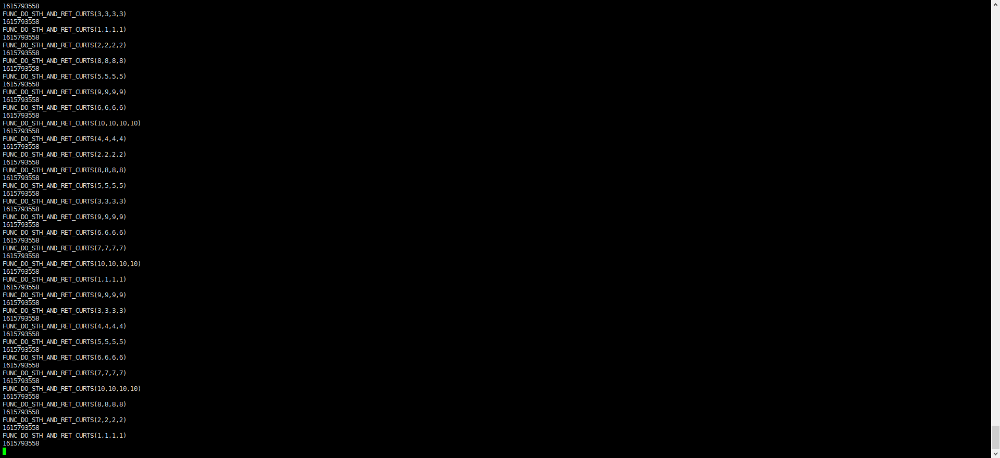

# Mysql5.7 Failover Test

今回はSysbenchのベンチマークテストをご紹介、テスト対象はMysql5.7とMysql5.8です

##　概要
本文章はSysbenchでMysqlの性能測定をご紹介します。

## 1 Sysbech環境をインストールする
## 2 Sysbechでデータを準備する
## 3 Failoverテストを実行する

## 1 Sysbech環境をインストールする

Sysbenchとはよくデータベース、ファイルシステムやCPU、メモリなどシステムのベンチマークを行うソフトウェアです。

### 1-1 Sysbechインストール
### 1) ECSインスタンスを作成する
```
ECS：
Specifications:	64 vCPU 512 GiB ecs.r5.16xlarge
OS：CentOS  7.7 64-bit
```


### 2) Sysbenchをインストールする

①以下のコマンドでSysbenchインストールが行えます。
```
# yum install gcc gcc-c++ autoconf automake make libtool bzr mysql-devel git mysql
```
```
[root@iZ6weguwx79n1hisd6nyb7Z ~]# yum install gcc gcc-c++ autoconf automake make libtool bzr mysql-devel git mysql
Loaded plugins: fastestmirror
Determining fastest mirrors
base                                                                                                                                                                                                                                                   | 3.6 kB  00:00:00     
epel                                                                                                                                                                                                                                                   | 4.7 kB  00:00:00     
extras                                                                                                                                                                                                                                                 | 2.9 kB  00:00:00     
updates                                                                                                                                                                                                                                                | 2.9 kB  00:00:00     
(1/7): epel/x86_64/group_gz                                                                                                                                                                                                                            |  96 kB  00:00:00      
......
Installed:
  autoconf.noarch 0:2.69-11.el7          automake.noarch 0:1.13.4-3.el7    bzr.x86_64 0:2.5.1-14.el7    gcc.x86_64 0:4.8.5-44.el7    gcc-c++.x86_64 0:4.8.5-44.el7    git.x86_64 0:1.8.3.1-23.el7_8    libtool.x86_64 0:2.4.2-22.el7_3    mariadb.x86_64 1:5.5.68-1.el7   
  mariadb-devel.x86_64 1:5.5.68-1.el7   

Dependency Installed:
  cpp.x86_64 0:4.8.5-44.el7                   glibc-devel.x86_64 0:2.17-323.el7_9       glibc-headers.x86_64 0:2.17-323.el7_9      kernel-headers.x86_64 0:3.10.0-1160.15.2.el7     keyutils-libs-devel.x86_64 0:1.5.8-3.el7     krb5-devel.x86_64 0:1.15.1-50.el7        
  libcom_err-devel.x86_64 0:1.42.9-19.el7     libkadm5.x86_64 0:1.15.1-50.el7           libmpc.x86_64 0:1.0.1-3.el7                libselinux-devel.x86_64 0:2.5-15.el7             libsepol-devel.x86_64 0:2.5-10.el7           libstdc++-devel.x86_64 0:4.8.5-44.el7    
  libverto-devel.x86_64 0:0.2.5-4.el7         mpfr.x86_64 0:3.1.1-4.el7                 openssl-devel.x86_64 1:1.0.2k-21.el7_9     pcre-devel.x86_64 0:8.32-17.el7                  perl-Data-Dumper.x86_64 0:2.145-3.el7        perl-Error.noarch 1:0.17020-2.el7        
  perl-Git.noarch 0:1.8.3.1-23.el7_8          perl-TermReadKey.x86_64 0:2.30-20.el7     perl-Test-Harness.noarch 0:3.28-3.el7      perl-Thread-Queue.noarch 0:3.02-2.el7            zlib-devel.x86_64 0:1.2.7-19.el7_9          

Dependency Updated:
  e2fsprogs.x86_64 0:1.42.9-19.el7    e2fsprogs-libs.x86_64 0:1.42.9-19.el7    glibc.x86_64 0:2.17-323.el7_9            glibc-common.x86_64 0:2.17-323.el7_9    krb5-libs.x86_64 0:1.15.1-50.el7    libcom_err.x86_64 0:1.42.9-19.el7    libgcc.x86_64 0:4.8.5-44.el7         
  libgomp.x86_64 0:4.8.5-44.el7       libselinux.x86_64 0:2.5-15.el7           libselinux-python.x86_64 0:2.5-15.el7    libselinux-utils.x86_64 0:2.5-15.el7    libss.x86_64 0:1.42.9-19.el7        libstdc++.x86_64 0:4.8.5-44.el7      mariadb-libs.x86_64 1:5.5.68-1.el7   
  nscd.x86_64 0:2.17-323.el7_9        openssl.x86_64 1:1.0.2k-21.el7_9         openssl-libs.x86_64 1:1.0.2k-21.el7_9    zlib.x86_64 0:1.2.7-19.el7_9           
Complete!
```


②下記のリンクからSysbenchをダウンロードする
```
# git clone https://github.com/akopytov/sysbench.git
```

```
[root@iZ6weguwx79n1hisd6nyb7Z ~]# git clone https://github.com/akopytov/sysbench.git
Cloning into 'sysbench'...
remote: Enumerating objects: 62, done.
remote: Counting objects: 100% (62/62), done.
remote: Compressing objects: 100% (33/33), done.
remote: Total 10220 (delta 28), reused 44 (delta 23), pack-reused 10158
Receiving objects: 100% (10220/10220), 4.23 MiB | 1.38 MiB/s, done.
Resolving deltas: 100% (7326/7326), done.
```

③SysBench 1.0.18バージョンにチェックアウトする
```
# cd sysbench
# git checkout 1.0.18
```
```
[root@iZ6weguwx79n1hisd6nyb7Z ~]# cd sysbench
[root@iZ6weguwx79n1hisd6nyb7Z sysbench]# git checkout 1.0.18
Note: checking out '1.0.18'.

You are in 'detached HEAD' state. You can look around, make experimental
changes and commit them, and you can discard any commits you make in this
state without impacting any branches by performing another checkout.

If you want to create a new branch to retain commits you create, you may
do so (now or later) by using -b with the checkout command again. Example:

  git checkout -b new_branch_name

HEAD is now at ab7d582... Release 1.0.18.
```
 

④autogen.shを実行します
```
# ./autogen.sh
# ./configure --prefix=/usr --mandir=/usr/share/man
```
```
[root@iZ6weguwx79n1hisd6nyb7Z sysbench]# ./autogen.sh
./autogen.sh: running `libtoolize --copy --force' 
libtoolize: putting auxiliary files in AC_CONFIG_AUX_DIR, `config'.
libtoolize: copying file `config/ltmain.sh'
libtoolize: putting macros in AC_CONFIG_MACRO_DIR, `m4'.
libtoolize: copying file `m4/libtool.m4'
libtoolize: copying file `m4/ltoptions.m4'
libtoolize: copying file `m4/ltsugar.m4'
libtoolize: copying file `m4/ltversion.m4'
libtoolize: copying file `m4/lt~obsolete.m4'
./autogen.sh: running `aclocal -I m4' 
./autogen.sh: running `autoheader' 
./autogen.sh: running `automake -c --foreign --add-missing' 
configure.ac:59: installing 'config/ar-lib'
configure.ac:45: installing 'config/compile'
configure.ac:27: installing 'config/config.guess'
configure.ac:27: installing 'config/config.sub'
configure.ac:32: installing 'config/install-sh'
configure.ac:32: installing 'config/missing'
src/Makefile.am: installing 'config/depcomp'
parallel-tests: installing 'config/test-driver'
./autogen.sh: running `autoconf' 
Libtoolized with: libtoolize (GNU libtool) 2.4.2
Automade with: automake (GNU automake) 1.13.4
Configured with: autoconf (GNU Autoconf) 2.69
[root@iZ6weguwx79n1hisd6nyb7Z sysbench]# ./configure --prefix=/usr --mandir=/usr/share/man
checking build system type... x86_64-unknown-linux-gnu
checking host system type... x86_64-unknown-linux-gnu
checking target system type... x86_64-unknown-linux-gnu
checking for a BSD-compatible install... /usr/bin/install -c
checking whether build environment is sane... yes
checking for a thread-safe mkdir -p... /usr/bin/mkdir -p
......
config.status: executing libtool commands
===============================================================================
sysbench version   : 1.0.18-ab7d582
CC                 : gcc -std=gnu99
CFLAGS             : -O2 -funroll-loops -ggdb3  -march=core2 -Wall -Wextra -Wpointer-arith -Wbad-function-cast -Wstrict-prototypes -Wnested-externs -Wno-format-zero-length -Wundef -Wstrict-prototypes -Wmissing-prototypes -Wmissing-declarations -Wredundant-decls -Wcast-align -Wvla   -pthread
CPPFLAGS           : -D_GNU_SOURCE   -I$(top_srcdir)/src -I$(abs_top_builddir)/third_party/luajit/inc -I$(abs_top_builddir)/third_party/concurrency_kit/include
LDFLAGS            : -L/usr/lib 
LIBS               : -lm 
EXTRA_LDFLAGS      : 

prefix             : /usr
bindir             : ${prefix}/bin
libexecdir         : ${prefix}/libexec
mandir             : /usr/share/man
datadir            : ${prefix}/share

MySQL support      : yes
Drizzle support    : no
AttachSQL support  : no
Oracle support     : no
PostgreSQL support : no

LuaJIT             : bundled
LUAJIT_CFLAGS      : -I$(abs_top_builddir)/third_party/luajit/inc
LUAJIT_LIBS        : $(abs_top_builddir)/third_party/luajit/lib/libluajit-5.1.a -ldl
LUAJIT_LDFLAGS     : -rdynamic

Concurrency Kit    : bundled
CK_CFLAGS          : -I$(abs_top_builddir)/third_party/concurrency_kit/include
CK_LIBS            : $(abs_top_builddir)/third_party/concurrency_kit/lib/libck.a
configure flags    : 
===============================================================================

```

 

 

⑤コンパイル
```
# make
# make install
```
```
[root@iZ6weguwx79n1hisd6nyb7Z sysbench]# make
Making all in doc
make[1]: Entering directory `/root/sysbench/doc'
Making all in xsl
make[2]: Entering directory `/root/sysbench/doc/xsl'
make[2]: Nothing to be done for `all'.
make[2]: Leaving directory `/root/sysbench/doc/xsl'
make[2]: Entering directory `/root/sysbench/doc'
touch manual.html
make[2]: Leaving directory `/root/sysbench/doc'
make[1]: Leaving directory `/root/sysbench/doc'
Making all in third_party/luajit
make[1]: Entering directory `/root/sysbench/third_party/luajit'
make -C ./luajit clean
make[2]: Entering directory `/root/sysbench/third_party/luajit/luajit'
make -C src clean
省略
完了しました

```

 
 
 

⑥SysBench clientの設定、ffffffffは 32 coresが使われている. 
```
sudo sh -c 'for x in /sys/class/net/eth0/queues/rx-*; do echo ffffffff>$x/rps_cpus; done'
```
```
sudo sh -c "echo 32768 > /proc/sys/net/core/rps_sock_flow_entries"
sudo sh -c "echo 4096 > /sys/class/net/eth0/queues/rx-0/rps_flow_cnt"
sudo sh -c "echo 4096 > /sys/class/net/eth0/queues/rx-1/rps_flow_cnt"
```
 


⑦インストール完了

 


操作ガイドは下記のユーザーガイドもご参照ください
https://www.alibabacloud.com/help/doc-detail/146103.htm?spm=a2c63.l28256.b99.186.188d3784k2PqLH

iZ6weguwx79n1hisd6nyb7ZのImageを取って、ECSを作成する


### 3) Polardbインスタンスを作成する
PolarDB: Mysql5.7 8Core32GB

① Polardbインスタンスを作成する

 

② PolarDBのホワイトリストにECSプライベートIPを追加する

 

③ PolarDBのアカウントを追加する
 

④ テストDBを追加する
 

## 2 Sysbechでデータを準備する
### 2-1 Polardb-Mysql5.7に100GBデータを初期化する
①　ScriptをECSにアップロードする
 
 
 スクリプトファイル（sysbench.shとprepare.sh）を用意する
sysbench.sh
```
#!/bin/sh
LUA=/usr/share/sysbench/oltp_read_write.lua
SIZE=5000000
DB=mysql
#prepare data using primary host
HOST=pc-0iwjknp9do507eiak.mysql.polardb.japan.rds.aliyuncs.com
PORT=3306
USER=sbtest
PASSWORD=Test1234
DBNAME=sbtest
usage()
{
  echo "Usage: ./sysbench.sh <prepare|run|cleanup> <num of threads>"
  exit "${1}"
}
#chack argumets
if [ "${1}" = "" -o $# -gt 3 ]; then
  usage 1
elif [ "${2}" = "" ]; then
  THREADS=1
else
  THREADS=${2}
fi
echo "Running command: sysbench ${LUA} --db-driver=${DB} --mysql-host=${HOST} --mysql-port=${PORT} --mysql-user=${USER} --mysql-password=${PASSWORD} --mysql-db=${DBNAME} --table-size=${SIZE} --tables=500 --events=0 --time=60 --db-ps-mode=disable --percentile=95 --report-interval=1 --threads=${THREADS} ${1}"
sysbench ${LUA} --db-driver=${DB} --mysql-host=${HOST} --mysql-port=${PORT} --mysql-user=${USER} --mysql-password=${PASSWORD} --mysql-db=${DBNAME} --table-size=${SIZE} --tables=20 --events=0 --time=120 --db-ps-mode=disable --percentile=95 --report-interval=1 --threads=${THREADS} ${1}

```
prepare.sh

```
#!/bin/sh
mkdir -p logs
thread=100
echo "prepare data using default settings, ref sysbench SIZE"  >> logs/sysbench_read_write_0_prepare.log
./sysbench.sh prepare ${thread} >> logs/sysbench_read_write_0_prepare.log
echo "data had been successfully initialized."  >> logs/sysbench_read_write_0_prepare.log

```
②
Sysbenchでおよそ100GBデータをDBにPushする
```
# chmod a+x *.sh
# nohup sh prepare.sh 2>&1&
```
 

 


### 2-2 PolarDB-MysqlにPROCEDUREを作成する

①DMSでPolarDB-MysqlDBに接続し、下記のPROCEDUREを実行する

DMSでSetUpMySQLFailOverTest.sqlファイルのSQLを実行する

```
DROP PROCEDURE IF EXISTS `PROC_TEST_CREATE_FO_REQUIRED_DATA`$$
```


```
DELIMITER $$
CREATE PROCEDURE `PROC_TEST_CREATE_FO_REQUIRED_DATA` (in_data_row_count int)
BEGIN
    DECLARE nRetRowCount int default 0;
    DECLARE nLoopCounter int default 0;
    SELECT count(table_name) INTO nRetRowCount FROM information_schema.tables WHERE table_name IN ('nancy_fo_select','nancy_fo_update','nancy_fo_insert');
    IF nRetRowCount != 3 THEN
        -- create tables needed
        CREATE TABLE IF NOT EXISTS `nancy_fo_select` (  `id` bigint(20) unsigned NOT NULL AUTO_INCREMENT COMMENT 'primary key',  `gmt_create` datetime NOT NULL DEFAULT CURRENT_TIMESTAMP COMMENT 'create time',  `gmt_modified` datetime NOT NULL DEFAULT CURRENT_TIMESTAMP COMMENT 'modify datetime',  `aid` bigint(20) unsigned NOT NULL COMMENT 'A ID',  `abalance` bigint(20) unsigned NOT NULL COMMENT 'A BALANCE',  PRIMARY KEY (`id`),  KEY `idx_a_id` (`aid`)) ENGINE=InnoDB DEFAULT CHARSET=utf8mb4 ;
        CREATE TABLE IF NOT EXISTS `nancy_fo_update` (  `id` bigint(20) unsigned NOT NULL AUTO_INCREMENT COMMENT 'primary key',  `gmt_create` datetime NOT NULL DEFAULT CURRENT_TIMESTAMP COMMENT 'create time',  `gmt_modified` datetime NOT NULL DEFAULT CURRENT_TIMESTAMP COMMENT 'modify datetime',  `tid` bigint(20) unsigned NOT NULL COMMENT 'T ID',  `tbalance` bigint(20) unsigned NOT NULL COMMENT 'T BALANCE',  PRIMARY KEY (`id`),  KEY `idx_t_id` (`tid`)) ENGINE=InnoDB DEFAULT CHARSET=utf8mb4 ;
        CREATE TABLE IF NOT EXISTS `nancy_fo_insert` (  `id` bigint(20) unsigned NOT NULL AUTO_INCREMENT COMMENT 'primary key',  `gmt_create` datetime NOT NULL DEFAULT CURRENT_TIMESTAMP COMMENT 'create time',  `gmt_modified` datetime NOT NULL DEFAULT CURRENT_TIMESTAMP COMMENT 'modify datetime',  `tid` bigint(20) unsigned NOT NULL COMMENT 'T ID',  `bid` bigint(20) unsigned NOT NULL COMMENT 'B ID',  `aid` bigint(20) unsigned NOT NULL COMMENT 'A ID',  `delta` bigint(20) unsigned NOT NULL COMMENT 'DELTA',  `mtime` datetime NOT NULL COMMENT 'time stamp',  PRIMARY KEY (`id`)) ENGINE=InnoDB DEFAULT CHARSET=utf8mb4 ;
        -- initialize data needed
        TRUNCATE TABLE nancy_fo_select;
        TRUNCATE TABLE nancy_fo_update;
        TRUNCATE TABLE nancy_fo_insert;
        WHILE nLoopCounter < in_data_row_count do
            INSERT INTO nancy_fo_select (aid, abalance) VALUES (nLoopCounter, 4096 * nLoopCounter);
            INSERT INTO nancy_fo_update (tid, tbalance) VALUES (nLoopCounter, 8192 * nLoopCounter);
            SET nLoopCounter = nLoopCounter + 1;
        END WHILE;
        COMMIT;
    ELSE
        TRUNCATE TABLE nancy_fo_insert;
    END IF;
END$$
DELIMITER ;
```


```
-- create table struct and init 100000 data
call PROC_TEST_CREATE_FO_REQUIRED_DATA(100000);
```
 

```
-- create function
DELIMITER $$
DROP FUNCTION IF EXISTS `FUNC_DO_STH_AND_RET_CURTS`$$

DELIMITER $$
```
 
```
CREATE FUNCTION `FUNC_DO_STH_AND_RET_CURTS`(t_id int, b_id int, a_id int, delta_ int) RETURNS INT DETERMINISTIC
BEGIN
    DECLARE curTimeTs INT DEFAULT 0;
    DECLARE aBalanceValue INT DEFAULT 0;
    -- test logic
    SELECT abalance INTO aBalanceValue FROM nancy_fo_select WHERE aid = a_id LIMIT 1;
    UPDATE nancy_fo_update SET tbalance = tbalance + delta_ + aBalanceValue WHERE tid = t_id;
    INSERT INTO nancy_fo_insert (tid, bid, aid, delta, mtime) VALUES (t_id, b_id, a_id, delta_, CURRENT_TIMESTAMP);
    SET curTimeTs = UNIX_TIMESTAMP();
    RETURN curTimeTs;
END$$
DELIMITER ;
```
 
```
-- function result verification
SELECT FUNC_DO_STH_AND_RET_CURTS(100, 100, 100, 100);
SELECT * FROM nancy_fo_insert;
```


## 3 Failoverテストを実行する
### 3-1 ECSでScriptを実行開始する
①スクリプトファイル（fot.shとrun-fot.sh）を用意する
fot.sh
```
#!/bin/sh
HOST=pc-0iw244o83t3g94791.rwlb.japan.rds.aliyuncs.com
PORT=3306
USER=sbtest
PASSWORD=Test1234
DBNAME=sbtest

## default timeout
TIMEOUT_SECONDS=2

for x in {1..10}
do
timeout ${TIMEOUT_SECONDS} mysql -h ${HOST} -P ${PORT}  -D ${DBNAME} -u ${USER} -p${PASSWORD} -e "SELECT FUNC_DO_STH_AND_RET_CURTS($x,$x,$x,$x);"
retVal=$?
if [ $retVal -ne 0 ]; then
  echo "TIMEOUT OCCURRED! EVENT: "$1
fi
done

```
run-fot.sh

```
#!/bin/sh

TOTAL_EVENT_COUNT=$1
CONCURRENT_PROCESS=$2

echo "Start FailOver testing right now."

#seq 1000 | xargs -t -P10 -n1 ./fot.sh
seq ${TOTAL_EVENT_COUNT} | xargs -P${CONCURRENT_PROCESS} -n1 ./fot.sh

echo "ALL DONE"
```

②Scriptを実行開始する
```
# nohup sh run-fot.sh 20000 10 &
```

 

 

### 3-2 PolarDB-MysqlコンソールでNodeを切り替えする
③PolarDB-MysqlコンソールでNodeを切り替え開始する

 

 

 

④Nodeを切り替え中で、Script実行状態を確認する
 

 

### 3-3 FailOverを確認する
⑤Nodeを切り替え完了、Script実行を確認する
 

 
⑥FailOver計算する
```
# mv nohup.out Mysql5.7_8Core32GB_result_event_2000_concurrent_10.log
```
 
```
[root@iZ6wega8j6xeq3boflbonsZ 8Core32GB]#  grep -C 4 TIMEOUT  Mysql5.7_8Core32GB_result_event_2000_concurrent_10.log | head -n 6
FUNC_DO_STH_AND_RET_CURTS(9,9,9,9)
1615793512
FUNC_DO_STH_AND_RET_CURTS(10,10,10,10)
1615793512
TIMEOUT OCCURRED! EVENT: 10517
TIMEOUT OCCURRED! EVENT: 10515
```
```
[root@iZ6wega8j6xeq3boflbonsZ 8Core32GB]#  grep -C 4 TIMEOUT  Mysql5.7_8Core32GB_result_event_2000_concurrent_10.log | tail -n 6
TIMEOUT OCCURRED! EVENT: 10524
TIMEOUT OCCURRED! EVENT: 10523
FUNC_DO_STH_AND_RET_CURTS(1,1,1,1)
1615793530
FUNC_DO_STH_AND_RET_CURTS(3,3,3,3)
1615793530
```
```
# bc
# 1615793530-1615793512
18
```
 

Failowver タイムは18秒である、同じ手順で５回Scriptを実行し平均値を計算する
 

 以上です