# Sysbench on Mysql5.7

今回はSysbenchのベンチマークテストをご紹介、テスト対象はMysql5.7とMysql5.8です

##　概要
本文章はSysbenchでMysqlの性能測定をご紹介します。

## 1 Sysbech環境を準備する
## 2 Sysbench性能テスト
## 3 注意事項

## 1 Sysbech環境を準備する

SysBenchとはよくデータベース、ファイルシステムやCPU、メモリなどシステムのベンチマークを行うソフトウェアです。

### 1-1 Sysbechインストール
### 1) ECSインスタンスを作成する
```
ECS：
Specifications:	64 vCPU 512 GiB ecs.r5.16xlarge
OS：CentOS  7.7 64-bit
```
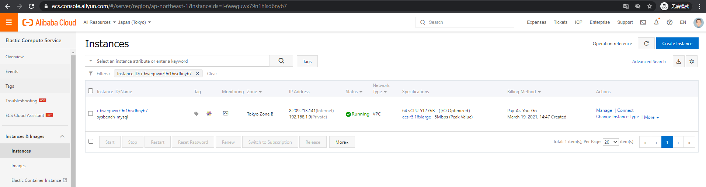

### 2) Sysbenchをインストールする

①以下のコマンドでSysbenchインストールが行えます。
```
# yum install gcc gcc-c++ autoconf automake make libtool bzr mysql-devel git mysql
```
```
[root@iZ6weguwx79n1hisd6nyb7Z ~]# yum install gcc gcc-c++ autoconf automake make libtool bzr mysql-devel git mysql
Loaded plugins: fastestmirror
Determining fastest mirrors
base                                                                                                                                                                                                                                                   | 3.6 kB  00:00:00     
epel                                                                                                                                                                                                                                                   | 4.7 kB  00:00:00     
extras                                                                                                                                                                                                                                                 | 2.9 kB  00:00:00     
updates                                                                                                                                                                                                                                                | 2.9 kB  00:00:00     
(1/7): epel/x86_64/group_gz                                                                                                                                                                                                                            |  96 kB  00:00:00      
......
Installed:
  autoconf.noarch 0:2.69-11.el7          automake.noarch 0:1.13.4-3.el7    bzr.x86_64 0:2.5.1-14.el7    gcc.x86_64 0:4.8.5-44.el7    gcc-c++.x86_64 0:4.8.5-44.el7    git.x86_64 0:1.8.3.1-23.el7_8    libtool.x86_64 0:2.4.2-22.el7_3    mariadb.x86_64 1:5.5.68-1.el7   
  mariadb-devel.x86_64 1:5.5.68-1.el7   

Dependency Installed:
  cpp.x86_64 0:4.8.5-44.el7                   glibc-devel.x86_64 0:2.17-323.el7_9       glibc-headers.x86_64 0:2.17-323.el7_9      kernel-headers.x86_64 0:3.10.0-1160.15.2.el7     keyutils-libs-devel.x86_64 0:1.5.8-3.el7     krb5-devel.x86_64 0:1.15.1-50.el7        
  libcom_err-devel.x86_64 0:1.42.9-19.el7     libkadm5.x86_64 0:1.15.1-50.el7           libmpc.x86_64 0:1.0.1-3.el7                libselinux-devel.x86_64 0:2.5-15.el7             libsepol-devel.x86_64 0:2.5-10.el7           libstdc++-devel.x86_64 0:4.8.5-44.el7    
  libverto-devel.x86_64 0:0.2.5-4.el7         mpfr.x86_64 0:3.1.1-4.el7                 openssl-devel.x86_64 1:1.0.2k-21.el7_9     pcre-devel.x86_64 0:8.32-17.el7                  perl-Data-Dumper.x86_64 0:2.145-3.el7        perl-Error.noarch 1:0.17020-2.el7        
  perl-Git.noarch 0:1.8.3.1-23.el7_8          perl-TermReadKey.x86_64 0:2.30-20.el7     perl-Test-Harness.noarch 0:3.28-3.el7      perl-Thread-Queue.noarch 0:3.02-2.el7            zlib-devel.x86_64 0:1.2.7-19.el7_9          

Dependency Updated:
  e2fsprogs.x86_64 0:1.42.9-19.el7    e2fsprogs-libs.x86_64 0:1.42.9-19.el7    glibc.x86_64 0:2.17-323.el7_9            glibc-common.x86_64 0:2.17-323.el7_9    krb5-libs.x86_64 0:1.15.1-50.el7    libcom_err.x86_64 0:1.42.9-19.el7    libgcc.x86_64 0:4.8.5-44.el7         
  libgomp.x86_64 0:4.8.5-44.el7       libselinux.x86_64 0:2.5-15.el7           libselinux-python.x86_64 0:2.5-15.el7    libselinux-utils.x86_64 0:2.5-15.el7    libss.x86_64 0:1.42.9-19.el7        libstdc++.x86_64 0:4.8.5-44.el7      mariadb-libs.x86_64 1:5.5.68-1.el7   
  nscd.x86_64 0:2.17-323.el7_9        openssl.x86_64 1:1.0.2k-21.el7_9         openssl-libs.x86_64 1:1.0.2k-21.el7_9    zlib.x86_64 0:1.2.7-19.el7_9           
Complete!
```

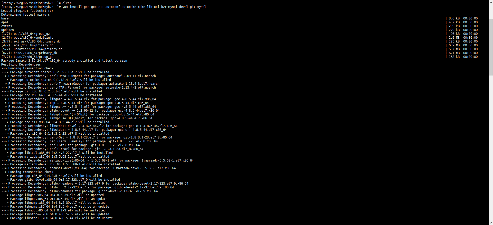

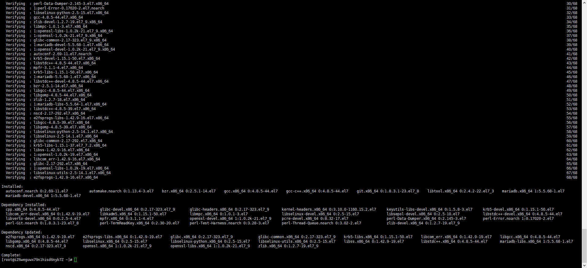

②下記のリンクからSysbenchをダウンロードする
```
# git clone https://github.com/akopytov/sysbench.git
```

```
[root@iZ6weguwx79n1hisd6nyb7Z ~]# git clone https://github.com/akopytov/sysbench.git
Cloning into 'sysbench'...
remote: Enumerating objects: 62, done.
remote: Counting objects: 100% (62/62), done.
remote: Compressing objects: 100% (33/33), done.
remote: Total 10220 (delta 28), reused 44 (delta 23), pack-reused 10158
Receiving objects: 100% (10220/10220), 4.23 MiB | 1.38 MiB/s, done.
Resolving deltas: 100% (7326/7326), done.
```

③SysBench 1.0.18バージョンにチェックアウトする
```
# cd sysbench
# git checkout 1.0.18
```
```
[root@iZ6weguwx79n1hisd6nyb7Z ~]# cd sysbench
[root@iZ6weguwx79n1hisd6nyb7Z sysbench]# git checkout 1.0.18
Note: checking out '1.0.18'.

You are in 'detached HEAD' state. You can look around, make experimental
changes and commit them, and you can discard any commits you make in this
state without impacting any branches by performing another checkout.

If you want to create a new branch to retain commits you create, you may
do so (now or later) by using -b with the checkout command again. Example:

  git checkout -b new_branch_name

HEAD is now at ab7d582... Release 1.0.18.
```
 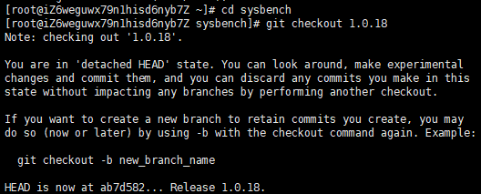

④autogen.shを実行します
```
# ./autogen.sh
# ./configure --prefix=/usr --mandir=/usr/share/man
```
```
[root@iZ6weguwx79n1hisd6nyb7Z sysbench]# ./autogen.sh
./autogen.sh: running `libtoolize --copy --force' 
libtoolize: putting auxiliary files in AC_CONFIG_AUX_DIR, `config'.
libtoolize: copying file `config/ltmain.sh'
libtoolize: putting macros in AC_CONFIG_MACRO_DIR, `m4'.
libtoolize: copying file `m4/libtool.m4'
libtoolize: copying file `m4/ltoptions.m4'
libtoolize: copying file `m4/ltsugar.m4'
libtoolize: copying file `m4/ltversion.m4'
libtoolize: copying file `m4/lt~obsolete.m4'
./autogen.sh: running `aclocal -I m4' 
./autogen.sh: running `autoheader' 
./autogen.sh: running `automake -c --foreign --add-missing' 
configure.ac:59: installing 'config/ar-lib'
configure.ac:45: installing 'config/compile'
configure.ac:27: installing 'config/config.guess'
configure.ac:27: installing 'config/config.sub'
configure.ac:32: installing 'config/install-sh'
configure.ac:32: installing 'config/missing'
src/Makefile.am: installing 'config/depcomp'
parallel-tests: installing 'config/test-driver'
./autogen.sh: running `autoconf' 
Libtoolized with: libtoolize (GNU libtool) 2.4.2
Automade with: automake (GNU automake) 1.13.4
Configured with: autoconf (GNU Autoconf) 2.69
[root@iZ6weguwx79n1hisd6nyb7Z sysbench]# ./configure --prefix=/usr --mandir=/usr/share/man
checking build system type... x86_64-unknown-linux-gnu
checking host system type... x86_64-unknown-linux-gnu
checking target system type... x86_64-unknown-linux-gnu
checking for a BSD-compatible install... /usr/bin/install -c
checking whether build environment is sane... yes
checking for a thread-safe mkdir -p... /usr/bin/mkdir -p
......
config.status: executing libtool commands
===============================================================================
sysbench version   : 1.0.18-ab7d582
CC                 : gcc -std=gnu99
CFLAGS             : -O2 -funroll-loops -ggdb3  -march=core2 -Wall -Wextra -Wpointer-arith -Wbad-function-cast -Wstrict-prototypes -Wnested-externs -Wno-format-zero-length -Wundef -Wstrict-prototypes -Wmissing-prototypes -Wmissing-declarations -Wredundant-decls -Wcast-align -Wvla   -pthread
CPPFLAGS           : -D_GNU_SOURCE   -I$(top_srcdir)/src -I$(abs_top_builddir)/third_party/luajit/inc -I$(abs_top_builddir)/third_party/concurrency_kit/include
LDFLAGS            : -L/usr/lib 
LIBS               : -lm 
EXTRA_LDFLAGS      : 

prefix             : /usr
bindir             : ${prefix}/bin
libexecdir         : ${prefix}/libexec
mandir             : /usr/share/man
datadir            : ${prefix}/share

MySQL support      : yes
Drizzle support    : no
AttachSQL support  : no
Oracle support     : no
PostgreSQL support : no

LuaJIT             : bundled
LUAJIT_CFLAGS      : -I$(abs_top_builddir)/third_party/luajit/inc
LUAJIT_LIBS        : $(abs_top_builddir)/third_party/luajit/lib/libluajit-5.1.a -ldl
LUAJIT_LDFLAGS     : -rdynamic

Concurrency Kit    : bundled
CK_CFLAGS          : -I$(abs_top_builddir)/third_party/concurrency_kit/include
CK_LIBS            : $(abs_top_builddir)/third_party/concurrency_kit/lib/libck.a
configure flags    : 
===============================================================================

```

 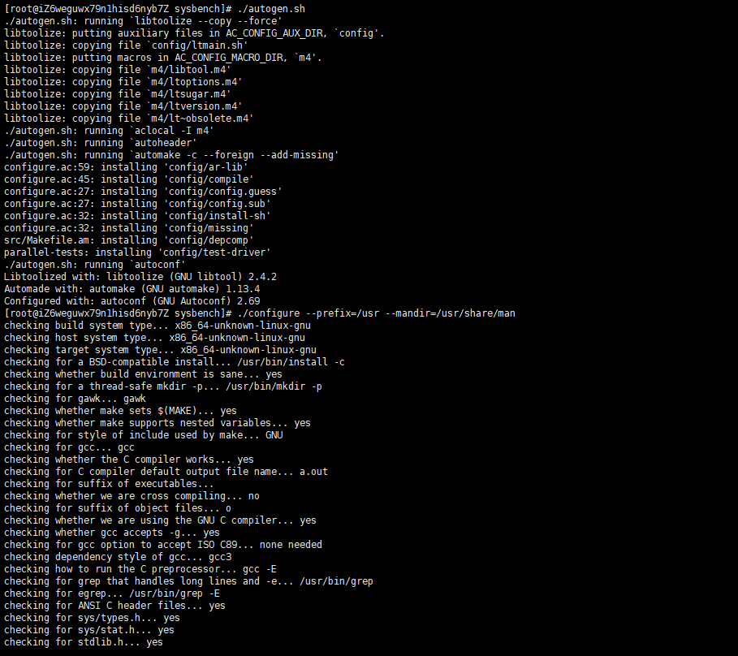

 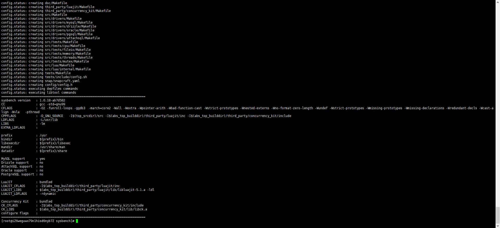

⑤コンパイル
```
# make
# make install
```
```
[root@iZ6weguwx79n1hisd6nyb7Z sysbench]# make
Making all in doc
make[1]: Entering directory `/root/sysbench/doc'
Making all in xsl
make[2]: Entering directory `/root/sysbench/doc/xsl'
make[2]: Nothing to be done for `all'.
make[2]: Leaving directory `/root/sysbench/doc/xsl'
make[2]: Entering directory `/root/sysbench/doc'
touch manual.html
make[2]: Leaving directory `/root/sysbench/doc'
make[1]: Leaving directory `/root/sysbench/doc'
Making all in third_party/luajit
make[1]: Entering directory `/root/sysbench/third_party/luajit'
make -C ./luajit clean
make[2]: Entering directory `/root/sysbench/third_party/luajit/luajit'
make -C src clean
省略
完了しました

```

 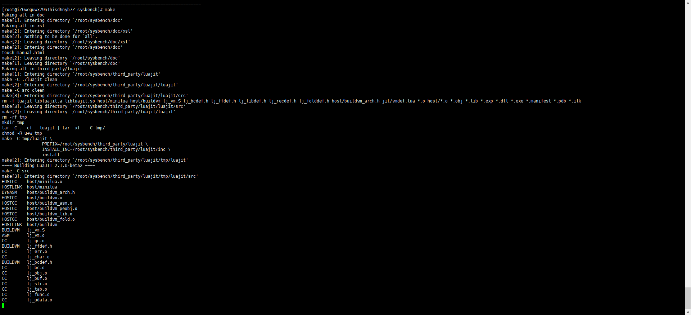
 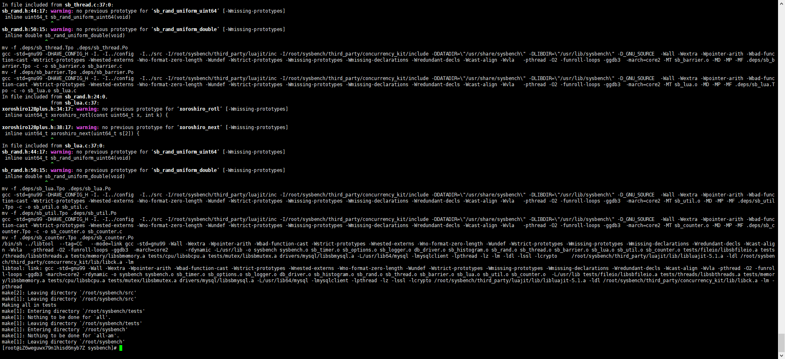
 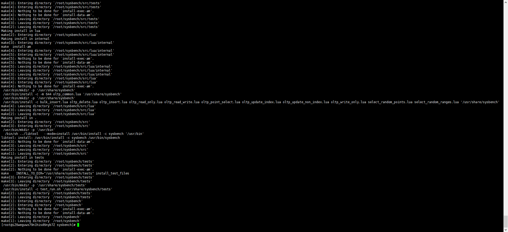

⑥SysBench clientの設定、ffffffffは 32 coresが使われている. 
```
sudo sh -c 'for x in /sys/class/net/eth0/queues/rx-*; do echo ffffffff>$x/rps_cpus; done'
```
```
sudo sh -c "echo 32768 > /proc/sys/net/core/rps_sock_flow_entries"
sudo sh -c "echo 4096 > /sys/class/net/eth0/queues/rx-0/rps_flow_cnt"
sudo sh -c "echo 4096 > /sys/class/net/eth0/queues/rx-1/rps_flow_cnt"
```
 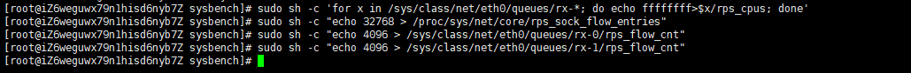


⑦インストール完了

 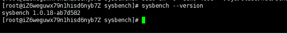


操作ガイドは下記のユーザーガイドもご参照ください
https://www.alibabacloud.com/help/doc-detail/146103.htm?spm=a2c63.l28256.b99.186.188d3784k2PqLH

### 3) Polardbインスタンスを作成する
PolarDB: 
Mysql5.7 8Core32GB

① Polardbインスタンスを作成する

 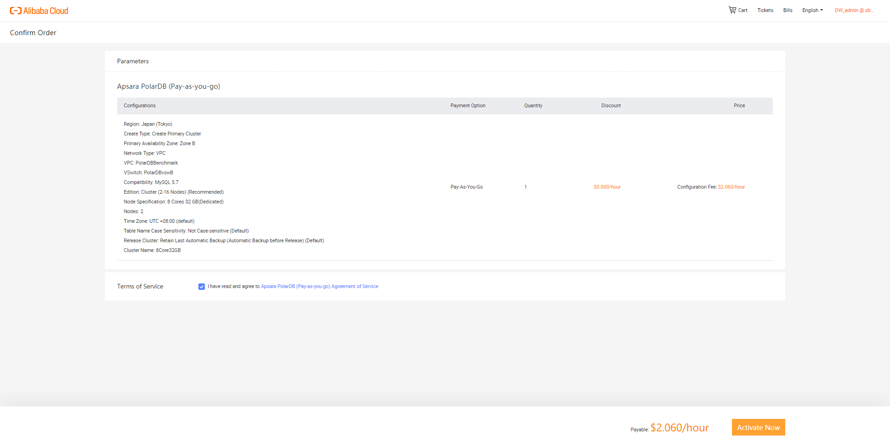

 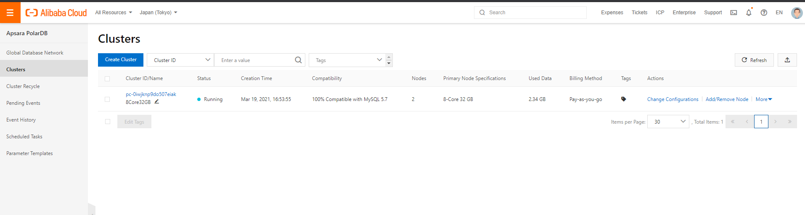

② PolarDBのホワイトリストにECSプライベートIPを追加する

 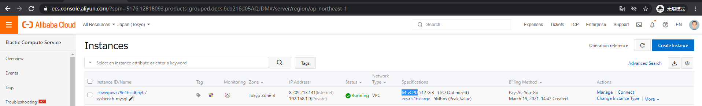

 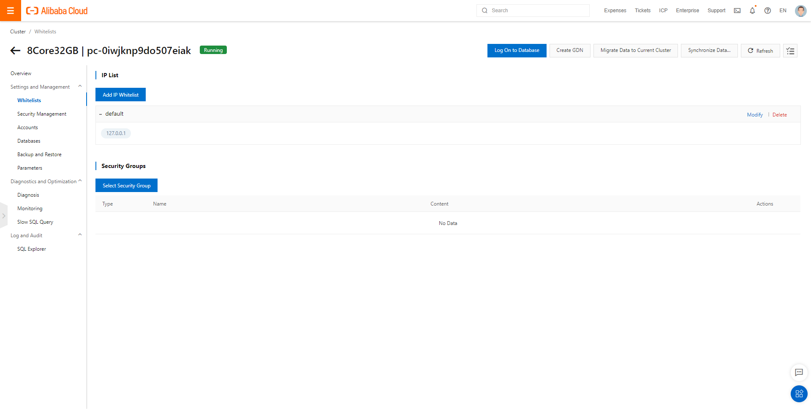

 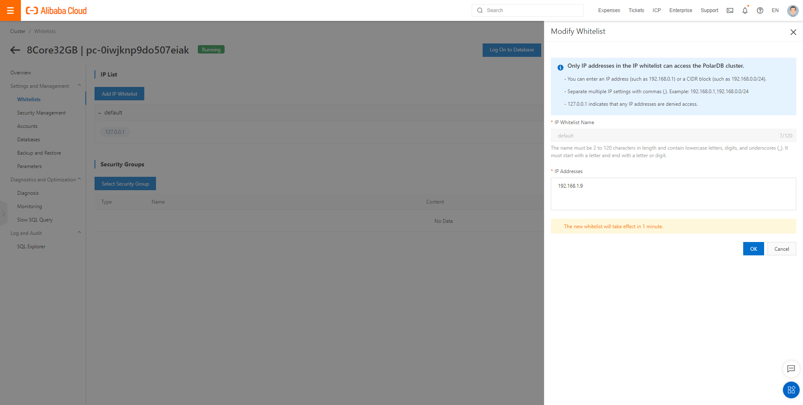

 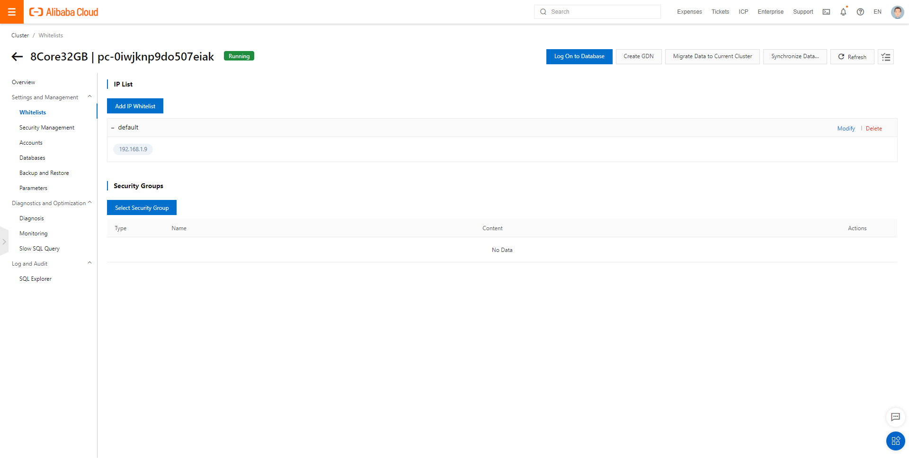

③ PolarDBのアカウントを追加する
 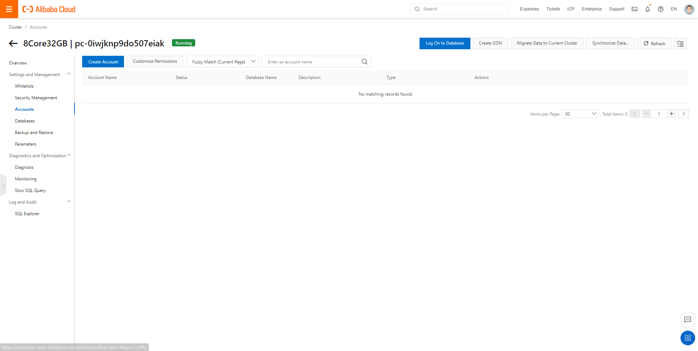
 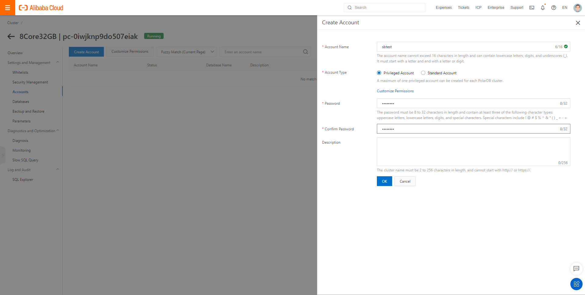
 

④ テストDBを追加する
 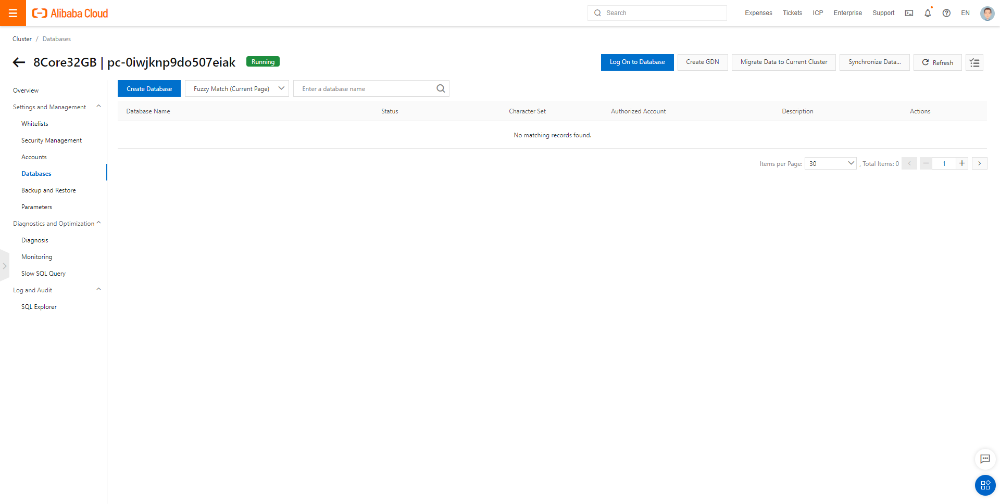
 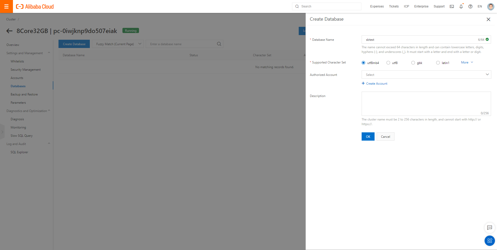
 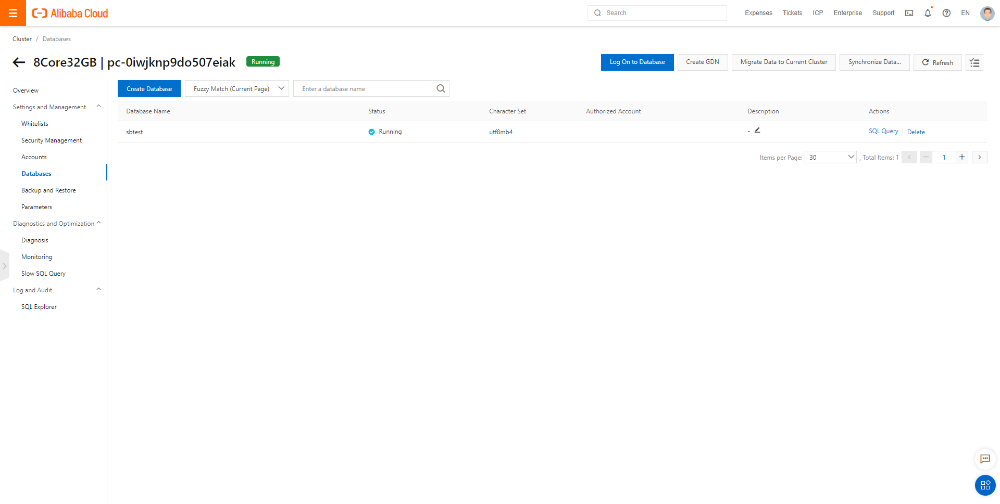

③ Polardbに接続するエンドポイント

プライマリーエンドポイント：データを書き込む際に、プライマリーエンドポイントに接続することをおすすめます
```
pc-0iwjknp9do507eiak.mysql.polardb.japan.rds.aliyuncs.com
```
 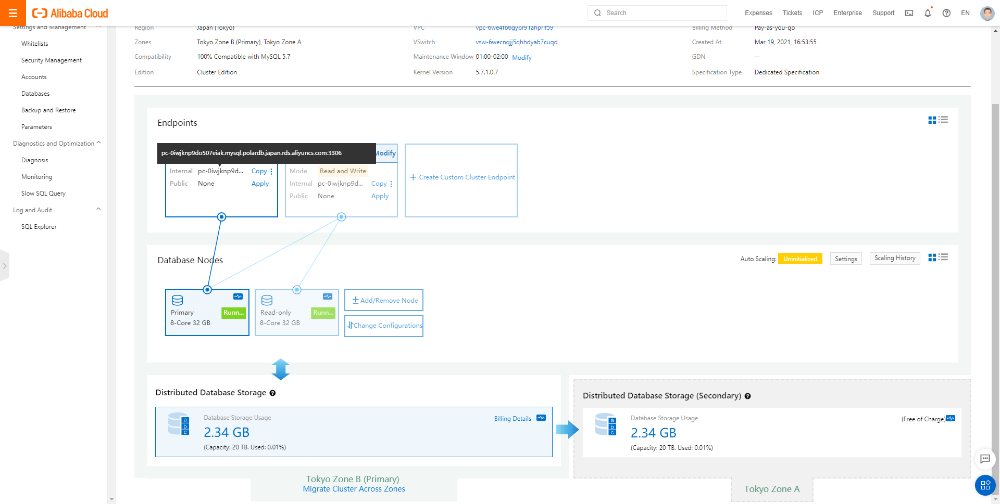
Read_WriteモードでSysbench実行するとき、クラスターエンドポイントに接続することをおすすめます

クラスターエンドポイント：
```
pc-0iwjknp9do507eiak.rwlb.japan.rds.aliyuncs.com
```
 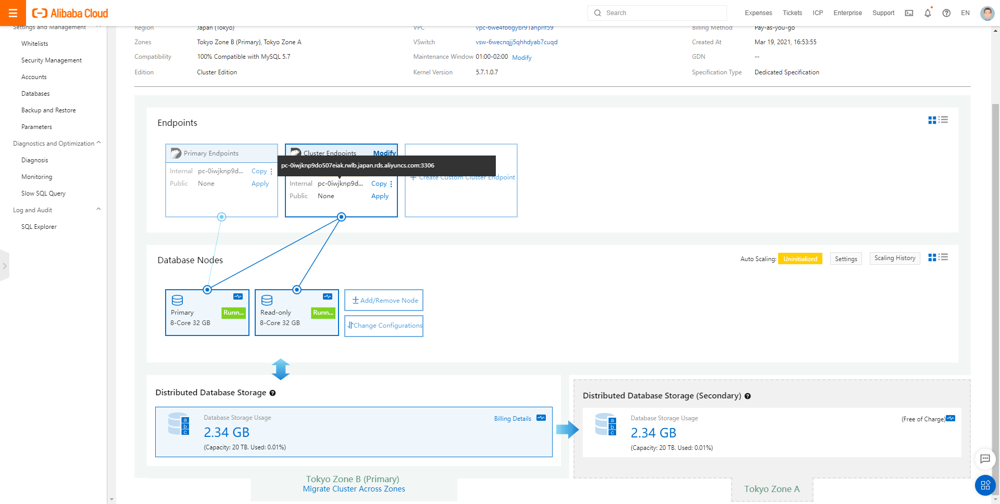

## 2 Sysbench性能テスト
### 2-1 Sysbenchデータを用意する

スクリプトファイル（sysbench.shとprepare.sh）を用意する

 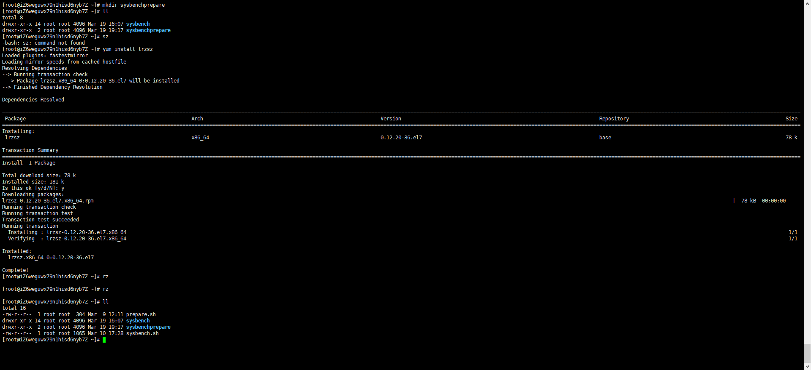
a.sysbench.sh

```
#!/bin/sh
LUA=/usr/share/sysbench/oltp_read_write.lua
SIZE=100000
DB=mysql
#prepare data using primary host
HOST=pc-0iwjknp9do507eiak.mysql.polardb.japan.rds.aliyuncs.com
PORT=3306
USER=sbtest
PASSWORD=Test1234
DBNAME=sbtest
usage()
{
  echo "Usage: ./sysbench.sh <prepare|run|cleanup> <num of threads>"
  exit "${1}"
}
#chack argumets
if [ "${1}" = "" -o $# -gt 3 ]; then
  usage 1
elif [ "${2}" = "" ]; then
  THREADS=1
else
  THREADS=${2}
fi
echo "Running command: sysbench ${LUA} --db-driver=${DB} --mysql-host=${HOST} --mysql-port=${PORT} --mysql-user=${USER} --mysql-password=${PASSWORD} --mysql-db=${DBNAME} --table-size=${SIZE} --tables=500 --events=0 --time=60 --db-ps-mode=disable --percentile=95 --report-interval=1 --threads=${THREADS} ${1}"
sysbench ${LUA} --db-driver=${DB} --mysql-host=${HOST} --mysql-port=${PORT} --mysql-user=${USER} --mysql-password=${PASSWORD} --mysql-db=${DBNAME} --table-size=${SIZE} --tables=20 --events=0 --time=120 --db-ps-mode=disable --percentile=95 --report-interval=1 --threads=${THREADS} ${1}

```
 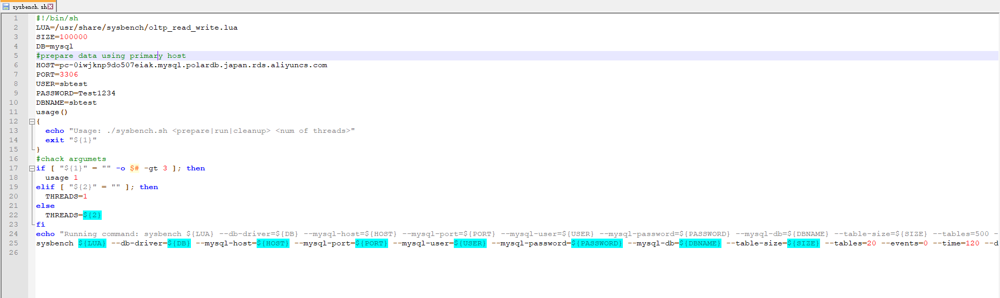

b.prepare.sh

```
#!/bin/sh
mkdir -p logs
thread=500
echo "prepare data using default settings, ref sysbench SIZE"  >> logs/sysbench_read_write_0_prepare.log
./sysbench.sh prepare ${thread} >> logs/sysbench_read_write_0_prepare.log
echo "data had been successfully initialized."  >> logs/sysbench_read_write_0_prepare.log

```

 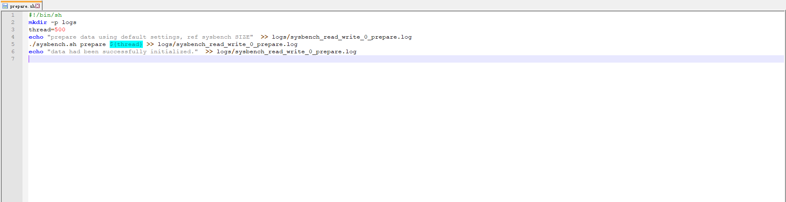

### 2-2 Sysbenchテストのデータを用意する

```
[root@iZ6weguwx79n1hisd6nyb7Z sysbenchprepare]# ll
total 8
-rwxr-xr-x 1 root root  304 Mar 19 19:30 prepare.sh
-rwxr-xr-x 1 root root 1039 Mar 19 19:30 sysbench.sh
[root@iZ6weguwx79n1hisd6nyb7Z sysbenchprepare]# nohup sh prepare.sh 2>&1&
[1] 24489
[root@iZ6weguwx79n1hisd6nyb7Z sysbenchprepare]# nohup: ignoring input and appending output to ‘nohup.out’
^C
[1]+  Done                    nohup sh prepare.sh 2>&1
[root@iZ6weguwx79n1hisd6nyb7Z sysbenchprepare]# ll
total 12
drwxr-xr-x 2 root root 4096 Mar 19 19:31 logs
-rw------- 1 root root    0 Mar 19 19:31 nohup.out
-rwxr-xr-x 1 root root  304 Mar 19 19:30 prepare.sh
-rwxr-xr-x 1 root root 1039 Mar 19 19:30 sysbench.sh
[root@iZ6weguwx79n1hisd6nyb7Z sysbenchprepare]# cd logs/
[root@iZ6weguwx79n1hisd6nyb7Z logs]# ll
total 4
-rw-r--r-- 1 root root 2810 Mar 19 19:31 sysbench_read_write_0_prepare.log
[root@iZ6weguwx79n1hisd6nyb7Z logs]# tail -f sysbench_read_write_0_prepare.log 
Creating a secondary index on 'sbtest10'...
Creating a secondary index on 'sbtest17'...
Creating a secondary index on 'sbtest16'...
Creating a secondary index on 'sbtest2'...
Creating a secondary index on 'sbtest7'...
Creating a secondary index on 'sbtest12'...
Creating a secondary index on 'sbtest5'...
Creating a secondary index on 'sbtest14'...
Creating a secondary index on 'sbtest20'...
data had been successfully initialized.


data had been successfully initialized.
^C

[root@iZ6weguwx79n1hisd6nyb7Z logs]# ll
total 4
-rw-r--r-- 1 root root 2810 Mar 19 19:31 sysbench_read_write_0_prepare.log
```
 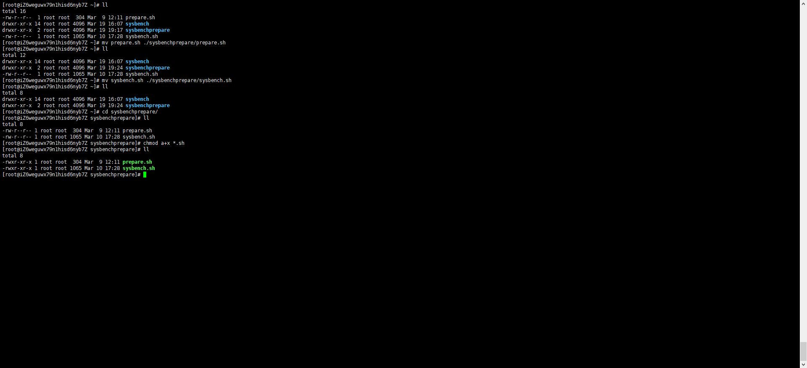

 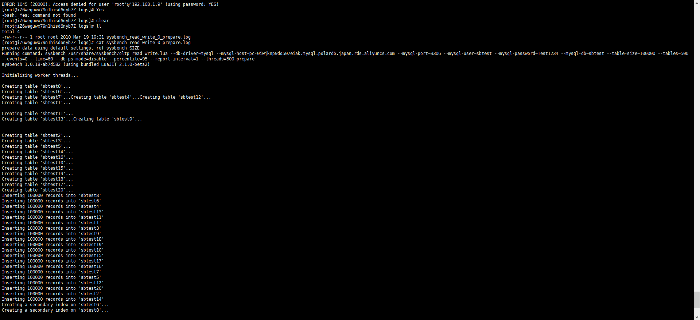

 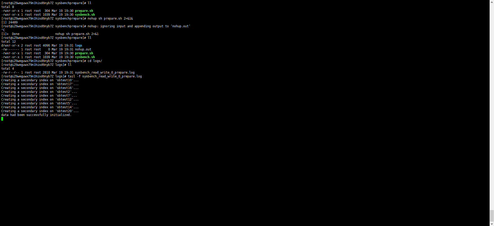

### 2-3 Sysbenchテストのデータを確認する


DMSで書き込んだデータを確認する、LinuxからもDBを接続し、確認できる
 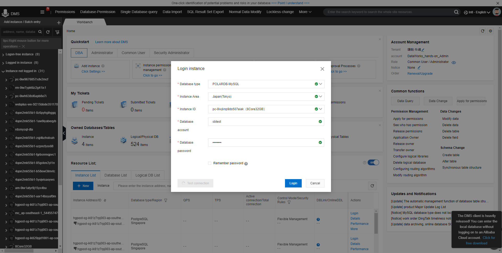

 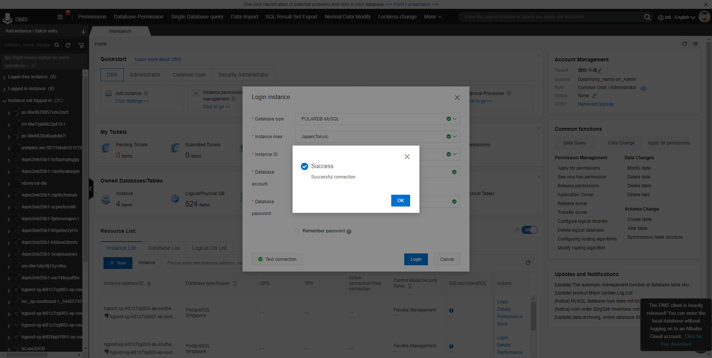
 ```
 select count(*) from sbtest10;
 ```
 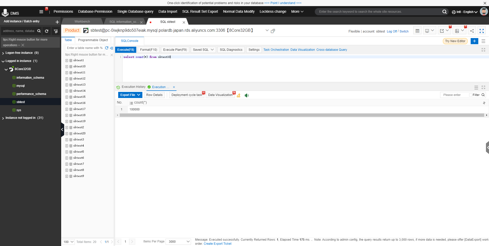

 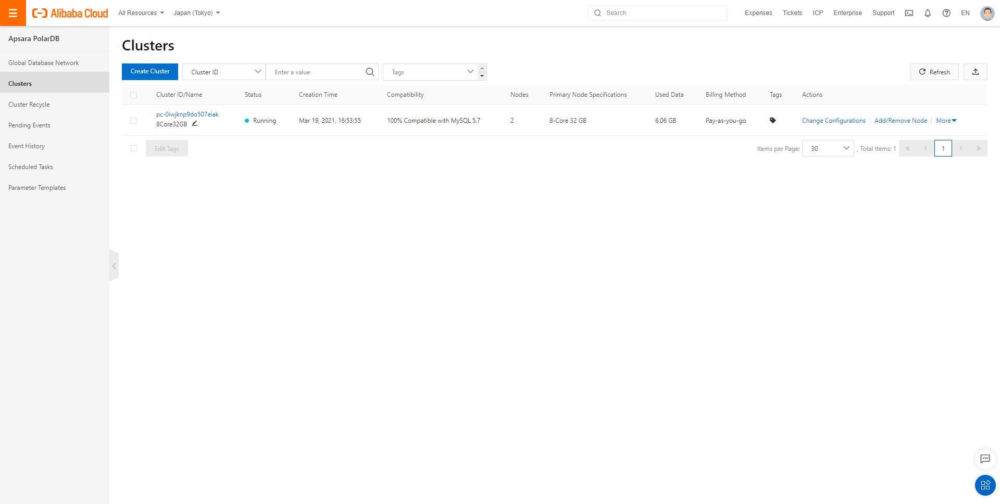

### 2-4 Sysbenchテストを実行する

①スクリプトファイル（sysbench.shとtest.sh）を用意する
sysbench.sh
```
#!/bin/sh
LUA=/usr/share/sysbench/oltp_read_write.lua
SIZE=100000
DB=mysql
#read writeモードの場合、クラスターホストで接続する
HOST=pc-0iwjknp9do507eiak.rwlb.japan.rds.aliyuncs.com
PORT=3306
USER=sbtest
PASSWORD=Test1234
DBNAME=sbtest
usage()
{
  echo "Usage: ./sysbench.sh <prepare|run|cleanup> <num of threads>"
  exit "${1}"
}
#chack argumets
if [ "${1}" = "" -o $# -gt 3 ]; then
  usage 1
elif [ "${2}" = "" ]; then
  THREADS=1
else
  THREADS=${2}
fi
echo "Running command: sysbench ${LUA} --db-driver=${DB} --mysql-host=${HOST} --mysql-port=${PORT} --mysql-user=${USER} --mysql-password=${PASSWORD} --mysql-db=${DBNAME} --table-size=${SIZE} --tables=500 --events=0 --time=60 --db-ps-mode=disable --percentile=95 --report-interval=1 --threads=${THREADS} ${1}"
sysbench ${LUA} --db-driver=${DB} --mysql-host=${HOST} --mysql-port=${PORT} --mysql-user=${USER} --mysql-password=${PASSWORD} --mysql-db=${DBNAME} --table-size=${SIZE} --tables=20 --events=0 --time=120 --db-ps-mode=disable --percentile=95 --report-interval=1 --threads=${THREADS} ${1}

```
test.sh

```
#!/bin/sh
DATE=`date '+%Y%m%d%H%M'`
mkdir $DATE

# thread=500
# echo "prepare data using default settings, ref sysbench SIZE"  >> ${DATE}/sysbench_read_write_main.log
# ./sysbench.sh prepare ${thread} >> ${DATE}/sysbench_read_write_main.log

for thread in 500 1000 1500 2000 2500 3000 3500	4000 4500 5000 5500 6000 6500 7000 7500 8000 8500 9000 9500 10000
do
    echo "Time: $(date +"%Y%m%d%H%M%S"), now running sysbench with thread of: " + ${thread}  >> ${DATE}/sysbench_read_write_${thread}.log
  ./sysbench.sh run ${thread} >> ${DATE}/sysbench_read_write_${thread}.log
done
# echo "cleaning data up."  >> ${DATE}/sysbench_read_write_main.log
# ./sysbench.sh cleanup ${thread} >> ${DATE}/sysbench_read_write_main.log

```
 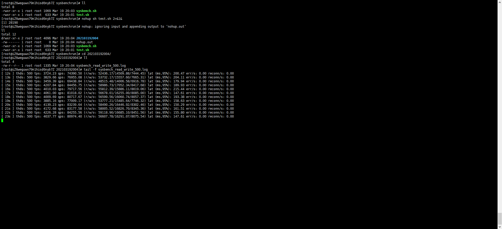

 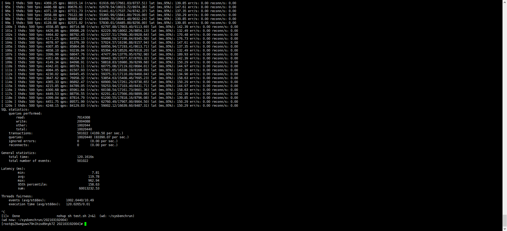

下記用にのSysbenchログファイルが生成されます
 sysbench_read_write_500.log
 sysbench_read_write_1000.log
 sysbench_read_write_1500.log
 ....

 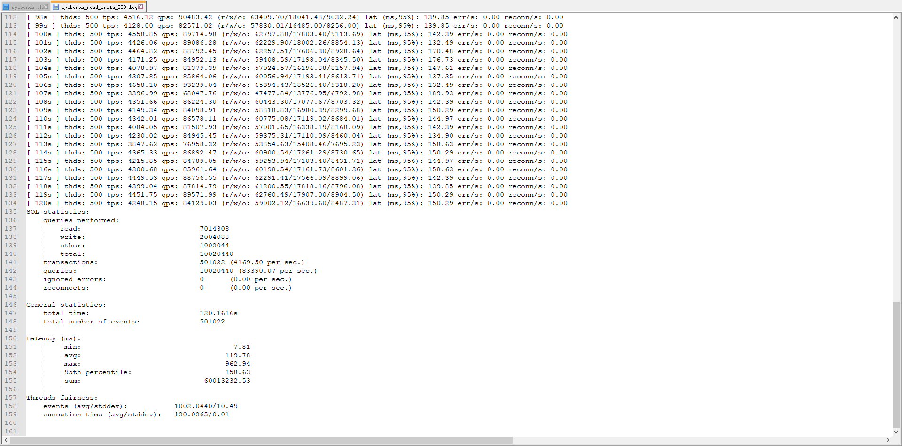

③　Sysbenchテスト性能測定結果を記録する
read/write/qps
 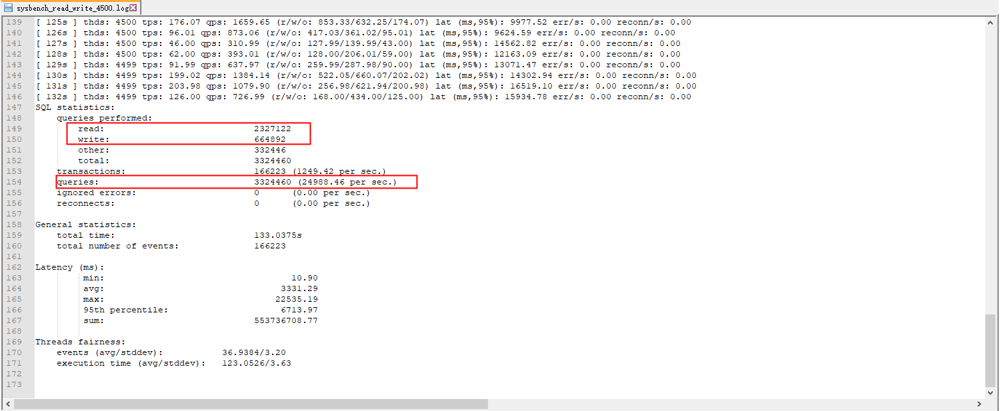

※ここまではデータをSIZE=100000に性能測定の手順をご紹介しました。


## 3 注意事項
### 1) 問題
threadsが大きくすると、下記のようにメモリが足りないエラーが発生する可能性がある

```
Running the test with following options:
Number of threads: 10000
Report intermediate results every 1 second(s)
Initializing random number generator from current time


Initializing worker threads...

FATAL: `thread_init' function failed: not enough memory
```
### 2) 解決方法：
LuaのJITを更新する

```
akopytovのgitからダウンロード
https://github.com/akopytov/LuaJIT.git

ダウンロードされたLuaJITに入れ替える  sysbench/third_party/luajit/luajit
    - BackUp： mv sysbench/third_party/luajit/luajit sysbench/third_party/luajit/backup_of_luajit
    - Replace　LuaJIT mv ${LUAJITダウンロードフォルダ} sysbench/third_party/luajit/luajit 

再度コンパイル
    - cd sysbench/
    - ./autogen.sh
    - ./configure --prefix=/usr --mandir=/usr/share/man
    - make clean
    - make -j 64 && make install
```

このサイトをご参照ください
https://github.com/akopytov/sysbench/issues/120

ここまではSysbenchのテスト方法をご紹介しました。

### 3) 今回テストするスクリプトファイル

※今回性能測定はSIZE=100000000 table=500 threadが500から10000まで実行しました。このぐらいのデータですとデータ準備する時間が二日間ほどかかります。（Redoログを削除する場合）データがおよそ12TBになる

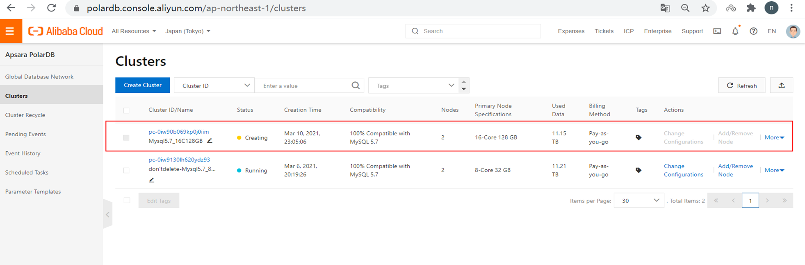
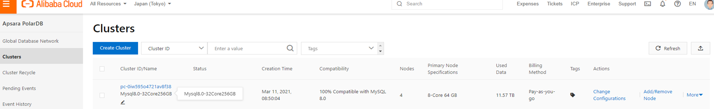

データPrepare：
①prepare.sh
```
#!/bin/sh
mkdir -p logs
thread=500
echo "prepare data using default settings, ref sysbench SIZE"  >> logs/sysbench_read_write_0_prepare.log
./sysbench.sh prepare ${thread} >> logs/sysbench_read_write_0_prepare.log
echo "data had been successfully initialized."  >> logs/sysbench_read_write_0_prepare.log

```
②sysbench.sh
```
#!/bin/sh
LUA=/usr/share/sysbench/oltp_read_write.lua
SIZE=100000000
DB=mysql
#prepare data using primary host
HOST=pc-0iw9130lh620ydz93.mysql.polardb.japan.rds.aliyuncs.com
PORT=3306
USER=sbtest
PASSWORD=Test1234
DBNAME=sbtest
usage()
{
  echo "Usage: ./sysbench.sh <prepare|run|cleanup> <num of threads>"
  exit "${1}"
}
#chack argumets
if [ "${1}" = "" -o $# -gt 3 ]; then
  usage 1
elif [ "${2}" = "" ]; then
  THREADS=1
else
  THREADS=${2}
fi
echo "Running command: sysbench ${LUA} --db-driver=${DB} --mysql-host=${HOST} --mysql-port=${PORT} --mysql-user=${USER} --mysql-password=${PASSWORD} --mysql-db=${DBNAME} --table-size=${SIZE} --tables=500 --events=0 --time=60 --db-ps-mode=disable --percentile=95 --report-interval=1 --threads=${THREADS} ${1}"
sysbench ${LUA} --db-driver=${DB} --mysql-host=${HOST} --mysql-port=${PORT} --mysql-user=${USER} --mysql-password=${PASSWORD} --mysql-db=${DBNAME} --table-size=${SIZE} --tables=20 --events=0 --time=120 --db-ps-mode=disable --percentile=95 --report-interval=1 --threads=${THREADS} ${1}

```
データを用意するコマンド:
```
nohup sh prepare.sh 2>&1&

```
SysbenchRunを実行する
データは12TBになり、大きいためThreadは最大6500までにしてください
①test.sh
```
#!/bin/sh
DATE=`date '+%Y%m%d%H%M'`
mkdir $DATE

# thread=500
# echo "prepare data using default settings, ref sysbench SIZE"  >> ${DATE}/sysbench_read_write_main.log
# ./sysbench.sh prepare ${thread} >> ${DATE}/sysbench_read_write_main.log

for thread in 500 1000 1500 2000 2500 3000 3500	4000 4500 5000 5500 6000 6500 7000 7500 8000 8500 9000 9500 10000
do
    echo "Time: $(date +"%Y%m%d%H%M%S"), now running sysbench with thread of: " + ${thread}  >> ${DATE}/sysbench_read_write_${thread}.log
  ./sysbench.sh run ${thread} >> ${DATE}/sysbench_read_write_${thread}.log
done
# echo "cleaning data up."  >> ${DATE}/sysbench_read_write_main.log
# ./sysbench.sh cleanup ${thread} >> ${DATE}/sysbench_read_write_main.log

```

②sysbench.sh
```
#!/bin/sh
LUA=/usr/share/sysbench/oltp_read_write.lua
SIZE=100000000
DB=mysql
#HOST=pc-0iw162qaide5441z8.mysql.polardb.japan.rds.aliyuncs.com
HOST=pc-0iw9130lh620ydz93.rwlb.japan.rds.aliyuncs.com
PORT=3306
USER=sbtest
PASSWORD=Test1234
DBNAME=sbtest
usage()
{
  echo "Usage: ./sysbench.sh <prepare|run|cleanup> <num of threads>"
  exit "${1}"
}
#chack argumets
if [ "${1}" = "" -o $# -gt 3 ]; then
  usage 1
elif [ "${2}" = "" ]; then
  THREADS=1
else
  THREADS=${2}
fi
echo "Running command: sysbench ${LUA} --db-driver=${DB} --mysql-host=${HOST} --mysql-port=${PORT} --mysql-user=${USER} --mysql-password=${PASSWORD} --mysql-db=${DBNAME} --table-size=${SIZE} --tables=500 --events=0 --time=60 --db-ps-mode=disable --percentile=95 --report-interval=1 --threads=${THREADS} ${1}"
sysbench ${LUA} --db-driver=${DB} --mysql-host=${HOST} --mysql-port=${PORT} --mysql-user=${USER} --mysql-password=${PASSWORD} --mysql-db=${DBNAME} --table-size=${SIZE} --tables=500 --events=0 --time=120 --db-ps-mode=disable --percentile=95 --report-interval=1 --threads=${THREADS} ${1}

```
③データを実行するコマンド:
```
nohup sh test.sh 2>&1&

```
④ログを確認する

sysbench_read_write_4500.log
read/write/qps
 

 以上です