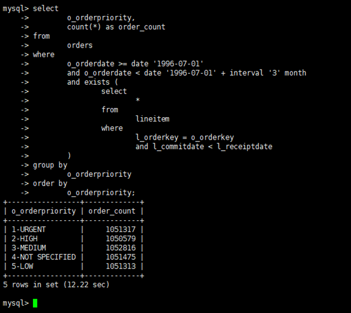
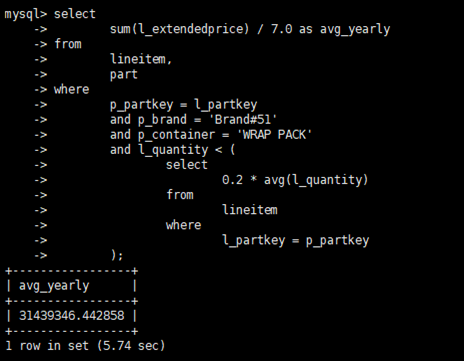

# TPC-H 2.18.0 on AnalyticDB MySQL

今回はTPC-Hのクエリをご紹介、テスト対象はAnalyticDB MySQLです

##　概要
本文章はTPC-H 2.18.0のHologresでAnalyticDB MySQLをご紹介します。

## 1 TPC-H 2.18.0環境を準備する
## 2 データセットを初期化する
## 3 データをADB-Mysqlにロードする
## 4 SQLクエリを実行して性能計測


## 1 TPC-H 2.18.0環境を準備する

###　TPC-H2.18.0とは
TPC-Hは複数のテーブルからなるデータベースで22種類のクエリからなるベンチマークスイートです，データ分析に要する処理の性能評価に利用される

###　インストール
### 1) ECSインスタンスを作成する
```
ECS：	
Specifications:	64 vCPU 512 GiB ecs.hfr6.16xlarge 
Disk:140GB
OS：CentOS  7.7 64-bit
```


### 2) TPC-H 2.18.0環境を準備する

以下の手順でTPC-H 2.18.0環境を準備する。
①TPCHツールをダウンロードする<tpc-h-tool-2.18.0.7z>
②lrszをインストールする
```
# yum install -y lrzsz
```


③p7zipをインストールする
```
# yum install p7zip -y
# 7za x tpc-h-tool-2.18.0.7z 
```


④TPCHファイルを確認する
```
# cd 2.18.0_rc2
# ll
```
 

⑤gccをインストールする
```
# yum install gcc-c++
```

⑥tpch環境を設定する
```
# cd dbgen
# cp makefile.suite makefile
```
 

```
# vim makefile
　################
  ## CHANGE NAME OF ANSI COMPILER HERE
  ################
  CC      = gcc
  # Current values for DATABASE are: INFORMIX, DB2, ORACLE,
  #                                  SQLSERVER, SYBASE, TDAT (Teradata)
  # Current values for MACHINE are:  ATT, DOS, HP, IBM, ICL, MVS,
  #                                  SGI, SUN, U2200, VMS, LINUX, WIN32
  # Current values for WORKLOAD are:  TPCH
  DATABASE= MYSQL
  MACHINE = LINUX
  WORKLOAD = TPCH

```


```
# vim tpcd.h
  #ifdef MYSQL
  #define GEN_QUERY_PLAN ""
  #define START_TRAN "START TRANSACTION"
  #define END_TRAN "COMMIT"
  #define SET_OUTPUT ""
  #define SET_ROWCOUNT "limit %d;\n"
  #define SET_DBASE "use %s;\n"
  #endif
```

```
#make
```

```
make後二つexeファイルが生成される
dbgen：データ生成ツール。InfiniDB公式サイトのテストスクリプトでテストする際に、このツールを使ってtpch関連テーブルを生成する。
qgen：SQL生成ツール。初期化テストクエリを生成する、違うseedで生成されたクエリが異なるため、AlibabaCloudサイトで提供された22個クエリを使う
```


ここまでTPCH2.18.0環境を準備完了しました。

## 2 データセットを初期化する
①データセットを初期化する(ここの手順は何時間ほどかかります。)
```
# ./dbgen -s 100
```
 

備考：下記のようにchunkパラメータも指定できる。本テストは./dbgen -s 100でデータを生成する
https://help.aliyun.com/document_detail/156328.html?spm=a2c4g.11186623.6.938.61722994H2iWPQ
```
# ./dbgen -s $scale -C $chunks -S $i -f
-s：scale値を指定，例100GBの際にscale値は100、1TBの際にscale値は1000
-C：トータルchunkを指定
-S: 現在何個目のchunkを生成する
```
②初期化されたテーブルファイルを確認する
```
# ls -lh *tbl
-rw-r--r-- 1 root root 2.3G Apr 12 11:40 customer.tbl
-rw-r--r-- 1 root root  75G Apr 12 11:40 lineitem.tbl
-rw-r--r-- 1 root root 2.2K Apr 12 11:40 nation.tbl
-rw-r--r-- 1 root root  17G Apr 12 11:40 orders.tbl
-rw-r--r-- 1 root root  12G Apr 12 11:40 partsupp.tbl
-rw-r--r-- 1 root root 2.3G Apr 12 11:40 part.tbl
-rw-r--r-- 1 root root  389 Apr 12 11:40 region.tbl
-rw-r--r-- 1 root root 137M Apr 12 11:40 supplier.tbl

```
 

③テーブル詳細を確認する
```
# tail -f customer.tbl -n 50
```


```
# tail -f lineitem.tbl -n 50
```


```
# tail -f nation.tbl -n 50
```


```
# tail -f orders.tbl -n 50
```


```
# tail -f partsupp.tbl -n 50
```


```
# tail -f part.tbl -n 50
```


```
# tail -f region.tbl -n 50
```


```
# tail -f supplier.tbl -n 50
```


ここまで100GBのデータセットが準備完了しました

## 3 データをADB-Mysqlにロードする
### 1) AnalyticDB MySQLインスタンスを作成する
① AnalyticDB MySQLインスタンスを作成する（ECSのVPCと同じVPCで作成する）
AnalyticDB MySQL: 32Core128GB


②VPC endpointを確認する


③アカウントを作成する


④ECSのプライベートIPをホワイトリストに追加する


### 2)　AnalyticDB MySQLテーブルを作成する
①ECSでADBに接続する
```
mysql -ham-0iwt6rzn2zc17528759740.japan.ads.aliyuncs.com -P3306 -usbtest -pTest1234
```


②ADBにDBを作成する
```
mysql> create database tpch;
mysql> show databases;
mysql> use tpch;
```


③ADBにテーブルを作成する
createtable.ddlはdbgenのフォルダにアップロードする
```
mysql> source ./createtable.ddl
```
 

createtable.ddl内容は下記の通りです
```
CREATE TABLE `CUSTOMER` (
 `C_CUSTKEY` int NOT NULL,
 `C_NAME` varchar NOT NULL,
 `C_ADDRESS` varchar NOT NULL,
 `C_NATIONKEY` int NOT NULL,
 `C_PHONE` varchar NOT NULL,
 `C_ACCTBAL` decimal(12, 2) NOT NULL,
 `C_MKTSEGMENT` varchar NOT NULL,
 `C_COMMENT` varchar NOT NULL,
 primary key (c_custkey)
) 
DISTRIBUTE BY HASH(`c_custkey`) 
INDEX_ALL='Y';

CREATE TABLE `LINEITEM` (
 `L_ORDERKEY` bigint NOT NULL,
 `L_PARTKEY` int NOT NULL,
 `L_SUPPKEY` int NOT NULL,
 `L_LINENUMBER` bigint NOT NULL,
 `L_QUANTITY` decimal(12, 2) NOT NULL,
 `L_EXTENDEDPRICE` decimal(12, 2) NOT NULL,
 `L_DISCOUNT` decimal(12, 2) NOT NULL,
 `L_TAX` decimal(12, 2) NOT NULL,
 `L_RETURNFLAG` varchar NOT NULL,
 `L_LINESTATUS` varchar NOT NULL,
 `L_SHIPDATE` date NOT NULL,
 `L_COMMITDATE` date NOT NULL,
 `L_RECEIPTDATE` date NOT NULL,
 `L_SHIPINSTRUCT` varchar NOT NULL,
 `L_SHIPMODE` varchar NOT NULL,
 `L_COMMENT` varchar NOT NULL,
 primary key (l_orderkey,l_linenumber,l_shipdate)
) 
DISTRIBUTE BY HASH(`l_orderkey`) 
PARTITION BY VALUE(`date_format(l_shipdate, '%Y%m')`) 
LIFECYCLE 90 
INDEX_ALL='Y';

CREATE TABLE `NATION` (
 `N_NATIONKEY` int NOT NULL,
 `N_NAME` varchar NOT NULL,
 `N_REGIONKEY` int NOT NULL,
 `N_COMMENT` varchar,
 primary key (n_nationkey)
) DISTRIBUTE BY BROADCAST INDEX_ALL='Y';


CREATE TABLE `ORDERS` (
 `O_ORDERKEY` bigint NOT NULL,
 `O_CUSTKEY` int NOT NULL,
 `O_ORDERSTATUS` varchar NOT NULL,
 `O_TOTALPRICE` decimal(12, 2) NOT NULL,
 `O_ORDERDATE` date NOT NULL,
 `O_ORDERPRIORITY` varchar NOT NULL,
 `O_CLERK` varchar NOT NULL,
 `O_SHIPPRIORITY` int NOT NULL,
 `O_COMMENT` varchar NOT NULL,
 primary key (o_orderkey,o_orderdate)
) 
DISTRIBUTE BY HASH(`o_orderkey`) 
PARTITION BY VALUE(`date_format(O_ORDERDATE, '%Y%m')`) 
LIFECYCLE 90 
INDEX_ALL='Y';


CREATE TABLE `PART` (
 `P_PARTKEY` int NOT NULL,
 `P_NAME` varchar NOT NULL,
 `P_MFGR` varchar NOT NULL,
 `P_BRAND` varchar NOT NULL,
 `P_TYPE` varchar NOT NULL,
 `P_SIZE` int NOT NULL,
 `P_CONTAINER` varchar NOT NULL,
 `P_RETAILPRICE` decimal(12, 2) NOT NULL,
 `P_COMMENT` varchar NOT NULL,
 primary key (p_partkey)
) 
DISTRIBUTE BY HASH(`p_partkey`) 
INDEX_ALL='Y';

CREATE TABLE `PARTSUPP` (
 `PS_PARTKEY` int NOT NULL,
 `PS_SUPPKEY` int NOT NULL,
 `PS_AVAILQTY` int NOT NULL,
 `PS_SUPPLYCOST` decimal(12, 2) NOT NULL,
 `PS_COMMENT` varchar NOT NULL,
 primary key (ps_partkey,ps_suppkey)
) 
DISTRIBUTE BY HASH(`ps_partkey`) 
INDEX_ALL='Y';

CREATE TABLE `REGION` (
 `R_REGIONKEY` int NOT NULL,
 `R_NAME` varchar NOT NULL,
 `R_COMMENT` varchar,
 primary key (r_regionkey)
) 
DISTRIBUTE BY BROADCAST 
INDEX_ALL='Y';

CREATE TABLE `SUPPLIER` (
 `S_SUPPKEY` int NOT NULL,
 `S_NAME` varchar NOT NULL,
 `S_ADDRESS` varchar NOT NULL,
 `S_NATIONKEY` int NOT NULL,
 `S_PHONE` varchar NOT NULL,
 `S_ACCTBAL` decimal(12, 2) NOT NULL,
 `S_COMMENT` varchar NOT NULL,
 primary key (s_suppkey)
) 
DISTRIBUTE BY HASH(`s_suppkey`) 
INDEX_ALL='Y';
```
下記のリンクご参照：
https://help.aliyun.com/document_detail/156322.html?spm=a2c4g.11186623.6.943.511629947h9OkB

④ADBにテーブルを確認する
```
mysql> show tables;
```


### 3) テーブルをAnalyticDB MySQLにロードする
①ADBテーブルにデータをロードする
load.ddlはdbgenフォルダにアップロードする
```
mysql> source ./load.ddl
```


load.ddlファイル詳細：
```
load data local INFILE 'customer.tbl' INTO TABLE customer FIELDS TERMINATED BY '|';
load data local INFILE 'region.tbl' INTO TABLE region FIELDS TERMINATED BY '|';
load data local INFILE 'nation.tbl' INTO TABLE nation FIELDS TERMINATED BY '|';
load data local INFILE 'supplier.tbl' INTO TABLE supplier FIELDS TERMINATED BY '|';
load data local INFILE 'part.tbl' INTO TABLE part FIELDS TERMINATED BY '|';
load data local INFILE 'partsupp.tbl' INTO TABLE partsupp FIELDS TERMINATED BY '|';
load data local INFILE 'orders.tbl' INTO TABLE orders FIELDS TERMINATED BY '|';
load data local INFILE 'lineitem.tbl' INTO TABLE lineitem FIELDS TERMINATED BY '|';
```

 

データロードがタイムアウトのため、途切れてしまった場合、中断されたテーブルのみで再度ロードする
load-line.ddlはdbgenフォルダにアップロードする
```
mysql> source ./load-line.ddl
```
load-line.ddlファイル詳細：
```
load data local INFILE 'lineitem.tbl' INTO TABLE lineitem FIELDS TERMINATED BY '|';
```
 


## 4 SQLクエリを実行して性能計測
①ECSで実行クエリの生成
違うseedで生成されたクエリが異なるため、AlibabaCloudサイトで提供された22個クエリを使う
クエリは下記のリンクを参照ください
https://help.aliyun.com/document_detail/156330.html?spm=a2c4g.11186623.6.948.14ce73c93KjI4G

### 1) SQL1:25.71 sec
```
select
        l_returnflag,
        l_linestatus,
        sum(l_quantity) as sum_qty,
        sum(l_extendedprice) as sum_base_price,
        sum(l_extendedprice * (1 - l_discount)) as sum_disc_price,
        sum(l_extendedprice * (1 - l_discount) * (1 + l_tax)) as sum_charge,
        avg(l_quantity) as avg_qty,
        avg(l_extendedprice) as avg_price,
        avg(l_discount) as avg_disc,
        count(*) as count_order
from
        lineitem
where
        l_shipdate <= date '1998-12-01' - interval '120' day
group by
        l_returnflag,
        l_linestatus
order by
        l_returnflag,
        l_linestatus;
```


### 2) SQL2: 2.02 sec
```
select
        s_acctbal,
        s_name,
        n_name,
        p_partkey,
        p_mfgr,
        s_address,
        s_phone,
        s_comment
from
        part,
        supplier,
        partsupp,
        nation,
        region
where
        p_partkey = ps_partkey
        and s_suppkey = ps_suppkey
        and p_size = 48
        and p_type like '%STEEL'
        and s_nationkey = n_nationkey
        and n_regionkey = r_regionkey
        and r_name = 'EUROPE'
        and ps_supplycost = (
                select
                        min(ps_supplycost)
                from
                        partsupp,
                        supplier,
                        nation,
                        region
                where
                        p_partkey = ps_partkey
                        and s_suppkey = ps_suppkey
                        and s_nationkey = n_nationkey
                        and n_regionkey = r_regionkey
                        and r_name = 'EUROPE'
        )
order by
        s_acctbal desc,
        n_name,
        s_name,
        p_partkey
limit 100;
```


### 3) SQL3: 8.75 sec
```
select
        l_orderkey,
        sum(l_extendedprice * (1 - l_discount)) as revenue,
        o_orderdate,
        o_shippriority
from
        customer,
        orders,
        lineitem
where
        c_mktsegment = 'MACHINERY'
        and c_custkey = o_custkey
        and l_orderkey = o_orderkey
        and o_orderdate < date '1995-03-23'
        and l_shipdate > date '1995-03-23'
group by
        l_orderkey,
        o_orderdate,
        o_shippriority
order by
        revenue desc,
        o_orderdate
limit 10;
```
 

### 4) SQL4: 12.22 sec
```
select
        o_orderpriority,
        count(*) as order_count
from
        orders
where
        o_orderdate >= date '1996-07-01'
        and o_orderdate < date '1996-07-01' + interval '3' month
        and exists (
                select
                        *
                from
                        lineitem
                where
                        l_orderkey = o_orderkey
                        and l_commitdate < l_receiptdate
        )
group by
        o_orderpriority
order by
        o_orderpriority;
```
 

### 5) SQL5: 10.55 sec
```
select
        n_name,
        sum(l_extendedprice * (1 - l_discount)) as revenue
from
        customer,
        orders,
        lineitem,
        supplier,
        nation,
        region
where
        c_custkey = o_custkey
        and l_orderkey = o_orderkey
        and l_suppkey = s_suppkey
        and c_nationkey = s_nationkey
        and s_nationkey = n_nationkey
        and n_regionkey = r_regionkey
        and r_name = 'EUROPE'
        and o_orderdate >= date '1996-01-01'
        and o_orderdate < date '1996-01-01' + interval '1' year
group by
        n_name
order by
        revenue desc;
```
 

### 6) SQL6: 0.67 sec
```
select
        sum(l_extendedprice * l_discount) as revenue
from
        lineitem
where
        l_shipdate >= date '1996-01-01'
        and l_shipdate < date '1996-01-01' + interval '1' year
        and l_discount between 0.02 - 0.01 and 0.02 + 0.01
        and l_quantity < 24;
```
 

### 7) SQL7: 6.41 sec
```
select
        supp_nation,
        cust_nation,
        l_year,
        sum(volume) as revenue
from
        (
                select
                        n1.n_name as supp_nation,
                        n2.n_name as cust_nation,
                        extract(year from l_shipdate) as l_year,
                        l_extendedprice * (1 - l_discount) as volume
                from
                        supplier,
                        lineitem,
                        orders,
                        customer,
                        nation n1,
                        nation n2
                where
                        s_suppkey = l_suppkey
                        and o_orderkey = l_orderkey
                        and c_custkey = o_custkey
                        and s_nationkey = n1.n_nationkey
                        and c_nationkey = n2.n_nationkey
                        and (
                                (n1.n_name = 'CANADA' and n2.n_name = 'BRAZIL')
                                or (n1.n_name = 'BRAZIL' and n2.n_name = 'CANADA')
                        )
                        and l_shipdate between date '1995-01-01' and date '1996-12-31'
        ) as shipping
group by
        supp_nation,
        cust_nation,
        l_year
order by
        supp_nation,
        cust_nation,
        l_year;
```
 

### 8) SQL8: 17.09 sec
```
select
        o_year,
        sum(case
                when nation = 'BRAZIL' then volume
                else 0
        end) / sum(volume) as mkt_share
from
        (
                select
                        extract(year from o_orderdate) as o_year,
                        l_extendedprice * (1 - l_discount) as volume,
                        n2.n_name as nation
                from
                        part,
                        supplier,
                        lineitem,
                        orders,
                        customer,
                        nation n1,
                        nation n2,
                        region
                where
                        p_partkey = l_partkey
                        and s_suppkey = l_suppkey
                        and l_orderkey = o_orderkey
                        and o_custkey = c_custkey
                        and c_nationkey = n1.n_nationkey
                        and n1.n_regionkey = r_regionkey
                        and r_name = 'AMERICA'
                        and s_nationkey = n2.n_nationkey
                        and o_orderdate between date '1995-01-01' and date '1996-12-31'
                        and p_type = 'LARGE ANODIZED COPPER'
        ) as all_nations
group by
        o_year
order by
        o_year;
```
 

### 9) SQL9: 36.88 sec
```
select
        nation,
        o_year,
        sum(amount) as sum_profit
from
        (
                select
                        n_name as nation,
                        extract(year from o_orderdate) as o_year,
                        l_extendedprice * (1 - l_discount) - ps_supplycost * l_quantity as amount
                from
                        part,
                        supplier,
                        lineitem,
                        partsupp,
                        orders,
                        nation
                where
                        s_suppkey = l_suppkey
                        and ps_suppkey = l_suppkey
                        and ps_partkey = l_partkey
                        and p_partkey = l_partkey
                        and o_orderkey = l_orderkey
                        and s_nationkey = n_nationkey
                        and p_name like '%maroon%'
        ) as profit
group by
        nation,
        o_year
order by
        nation,
        o_year desc;
```


### 10) SQL10: 9.39 sec
```
select
        c_custkey,
        c_name,
        sum(l_extendedprice * (1 - l_discount)) as revenue,
        c_acctbal,
        n_name,
        c_address,
        c_phone,
        c_comment
from
        customer,
        orders,
        lineitem,
        nation
where
        c_custkey = o_custkey
        and l_orderkey = o_orderkey
        and o_orderdate >= date '1993-02-01'
        and o_orderdate < date '1993-02-01' + interval '3' month
        and l_returnflag = 'R'
        and c_nationkey = n_nationkey
group by
        c_custkey,
        c_name,
        c_acctbal,
        c_phone,
        n_name,
        c_address,
        c_comment
order by
        revenue desc
limit 20;
```


### 11) SQL11: 1.96 sec
```
select
        ps_partkey,
        sum(ps_supplycost * ps_availqty) as value
from
        partsupp,
        supplier,
        nation
where
        ps_suppkey = s_suppkey
        and s_nationkey = n_nationkey
        and n_name = 'EGYPT'
group by
        ps_partkey having
                sum(ps_supplycost * ps_availqty) > (
                        select
                                sum(ps_supplycost * ps_availqty) * 0.0001000000
                        from
                                partsupp,
                                supplier,
                                nation
                        where
                                ps_suppkey = s_suppkey
                                and s_nationkey = n_nationkey
                                and n_name = 'EGYPT'
                )
order by
        value desc;
```
 

### 12) SQL12: 3.98 sec
```
select
        l_shipmode,
        sum(case
                when o_orderpriority = '1-URGENT'
                        or o_orderpriority = '2-HIGH'
                        then 1
                else 0
        end) as high_line_count,
        sum(case
                when o_orderpriority <> '1-URGENT'
                        and o_orderpriority <> '2-HIGH'
                        then 1
                else 0
        end) as low_line_count
from
        orders,
        lineitem
where
        o_orderkey = l_orderkey
        and l_shipmode in ('FOB', 'AIR')
        and l_commitdate < l_receiptdate
        and l_shipdate < l_commitdate
        and l_receiptdate >= date '1997-01-01'
        and l_receiptdate < date '1997-01-01' + interval '1' year
group by
        l_shipmode
order by
        l_shipmode;
```
 

### 13) SQL13: 12.65 sec
```
select
        c_count,
        count(*) as custdist
from
        (
                select
                        c_custkey,
                        count(o_orderkey) as c_count
                from
                        customer left outer join orders on
                                c_custkey = o_custkey
                                and o_comment not like '%special%deposits%'
                group by
                        c_custkey
        ) c_orders
group by
        c_count
order by
        custdist desc,
        c_count desc;
```


### 14) SQL14: 1.22 sec
```
select
        100.00 * sum(case
                when p_type like 'PROMO%'
                        then l_extendedprice * (1 - l_discount)
                else 0
        end) / sum(l_extendedprice * (1 - l_discount)) as promo_revenue
from
        lineitem,
        part
where
        l_partkey = p_partkey
        and l_shipdate >= date '1997-06-01'
        and l_shipdate < date '1997-06-01' + interval '1' month;
```
 

### 15) SQL15: 2.83 sec
```
create view revenue0 (supplier_no, total_revenue) as
        select
                l_suppkey,
                sum(l_extendedprice * (1 - l_discount))
        from
                lineitem
        where
                l_shipdate >= date '1995-02-01'
                and l_shipdate < date '1995-02-01' + interval '3' month
        group by
                l_suppkey;


select
        s_suppkey,
        s_name,
        s_address,
        s_phone,
        total_revenue
from
        supplier,
        revenue0
where
        s_suppkey = supplier_no
        and total_revenue = (
                select
                        max(total_revenue)
                from
                        revenue0
        )
order by
        s_suppkey;

drop view revenue0;
```
 

### 16) SQL16: 2.07 sec
```
select
        p_brand,
        p_type,
        p_size,
        count(distinct ps_suppkey) as supplier_cnt
from
        partsupp,
        part
where
        p_partkey = ps_partkey
        and p_brand <> 'Brand#45'
        and p_type not like 'SMALL ANODIZED%'
        and p_size in (47, 15, 37, 30, 46, 16, 18, 6)
        and ps_suppkey not in (
                select
                        s_suppkey
                from
                        supplier
                where
                        s_comment like '%Customer%Complaints%'
        )
group by
        p_brand,
        p_type,
        p_size
order by
        supplier_cnt desc,
        p_brand,
        p_type,
        p_size;
```
 

 
### 17) SQL17: 5.74 sec
```
select
        sum(l_extendedprice) / 7.0 as avg_yearly
from
        lineitem,
        part
where
        p_partkey = l_partkey
        and p_brand = 'Brand#51'
        and p_container = 'WRAP PACK'
        and l_quantity < (
                select
                        0.2 * avg(l_quantity)
                from
                        lineitem
                where
                        l_partkey = p_partkey
        );
```
 

### 18) SQL18: 15.65 sec
```
select
        c_name,
        c_custkey,
        o_orderkey,
        o_orderdate,
        o_totalprice,
        sum(l_quantity)
from
        customer,
        orders,
        lineitem
where
        o_orderkey in (
                select
                        l_orderkey
                from
                        lineitem
                group by
                        l_orderkey having
                                sum(l_quantity) > 312
        )
        and c_custkey = o_custkey
        and o_orderkey = l_orderkey
group by
        c_name,
        c_custkey,
        o_orderkey,
        o_orderdate,
        o_totalprice
order by
        o_totalprice desc,
        o_orderdate
limit 100;
```


### 19) SQL19: 3.88 sec
```
select
        sum(l_extendedprice* (1 - l_discount)) as revenue
from
        lineitem,
        part
where
        (
                p_partkey = l_partkey
                and p_brand = 'Brand#52'
                and p_container in ('SM CASE', 'SM BOX', 'SM PACK', 'SM PKG')
                and l_quantity >= 3 and l_quantity <= 3 + 10
                and p_size between 1 and 5
                and l_shipmode in ('AIR', 'AIR REG')
                and l_shipinstruct = 'DELIVER IN PERSON'
        )
        or
        (
                p_partkey = l_partkey
                and p_brand = 'Brand#43'
                and p_container in ('MED BAG', 'MED BOX', 'MED PKG', 'MED PACK')
                and l_quantity >= 12 and l_quantity <= 12 + 10
                and p_size between 1 and 10
                and l_shipmode in ('AIR', 'AIR REG')
                and l_shipinstruct = 'DELIVER IN PERSON'
        )
        or
        (
                p_partkey = l_partkey
                and p_brand = 'Brand#52'
                and p_container in ('LG CASE', 'LG BOX', 'LG PACK', 'LG PKG')
                and l_quantity >= 21 and l_quantity <= 21 + 10
                and p_size between 1 and 15
                and l_shipmode in ('AIR', 'AIR REG')
                and l_shipinstruct = 'DELIVER IN PERSON'
        );
```
 

### 20) SQL20: 6.24 sec
```
select
        s_name,
        s_address
from
        supplier,
        nation
where
        s_suppkey in (
                select
                        ps_suppkey
                from
                        partsupp
                where
                        ps_partkey in (
                                select
                                        p_partkey
                                from
                                        part
                                where
                                        p_name like 'drab%'
                        )
                        and ps_availqty > (
                                select
                                        0.5 * sum(l_quantity)
                                from
                                        lineitem
                                where
                                        l_partkey = ps_partkey
                                        and l_suppkey = ps_suppkey
                                        and l_shipdate >= date '1996-01-01'
                                        and l_shipdate < date '1996-01-01' + interval '1' year
                        )
        )
        and s_nationkey = n_nationkey
        and n_name = 'KENYA'
order by
        s_name;
```
 

 

### 21) SQL21: 22.72 sec
```
select
        s_name,
        count(*) as numwait
from
        supplier,
        lineitem l1,
        orders,
        nation
where
        s_suppkey = l1.l_suppkey
        and o_orderkey = l1.l_orderkey
        and o_orderstatus = 'F'
        and l1.l_receiptdate > l1.l_commitdate
        and exists (
                select
                        *
                from
                        lineitem l2
                where
                        l2.l_orderkey = l1.l_orderkey
                        and l2.l_suppkey <> l1.l_suppkey
        )
        and not exists (
                select
                        *
                from
                        lineitem l3
                where
                        l3.l_orderkey = l1.l_orderkey
                        and l3.l_suppkey <> l1.l_suppkey
                        and l3.l_receiptdate > l3.l_commitdate
        )
        and s_nationkey = n_nationkey
        and n_name = 'PERU'
group by
        s_name
order by
        numwait desc,
        s_name
limit 100;
```
 

 
### 22) SQL22: 4.40 sec
```
select
        cntrycode,
        count(*) as numcust,
        sum(c_acctbal) as totacctbal
from
        (
                select
                        substring(c_phone from 1 for 2) as cntrycode,
                        c_acctbal
                from
                        customer
                where
                        substring(c_phone from 1 for 2) in
                                ('24', '32', '17', '18', '12', '14', '22')
                        and c_acctbal > (
                                select
                                        avg(c_acctbal)
                                from
                                        customer
                                where
                                        c_acctbal > 0.00
                                        and substring(c_phone from 1 for 2) in
                                                ('24', '32', '17', '18', '12', '14', '22')
                        )
                        and not exists (
                                select
                                        *
                                from
                                        orders
                                where
                                        o_custkey = c_custkey
                        )
        ) as custsale
group by
        cntrycode
order by
        cntrycode;
```
 

### 23) TPCH性能測定結果まとめ
ADB-Mysql(32 cores, 128G memory)

|TPC-H-2.18.0(100GB DataSet)|1st(sec)|2nd(sec)|
|:-|:-:|:-:|
|SQL1|25.71 |25.65 |
|SQL2|2.02 |1.35 |
|SQL3|8.75 |7.09 |
|SQL4|12.22 |12.35 |
|SQL5|10.55 |11.01 |
|SQL6|0.67 |0.4 |
|SQL7|6.41 |6.38 |
|SQL8|17.09 |16.32 |
|SQL9|36.88 |34.47 |
|SQL10|9.39 |8.06 |
|SQL11|1.96 |1.72 |
|SQL12|3.98 |3.5 |
|SQL13|12.65 |12.06 |
|SQL14|1.22 |1.19 |
|SQL15|2.83 |2.93 |
|SQL16|2.07 |2.1 |
|SQL17|5.74 |5.28 |
|SQL18|15.65 |16.42 |
|SQL19|3.88 |3.17 |
|SQL20|6.55|6.66 |
|SQL21|22.72|22.83 |
|SQL22|4.4 | 4.15|
|Total|213.34 | 205.09|
ここまでTPCH性能測定完了しました。